Define snap module bounds using custom shapes. This opens up lots of possibilities for snap map based dungeons. 
In the previous examples, the doors were aligned at the edges of the axis-aligned bounding box. Now you can place the
doors at any orientation, at the edge of your custom polygon shape and create a more tightly packed and organic looking level

We'll look at setting up custom bounds shapes (like boxes, cylinders or polygon) in your module level file

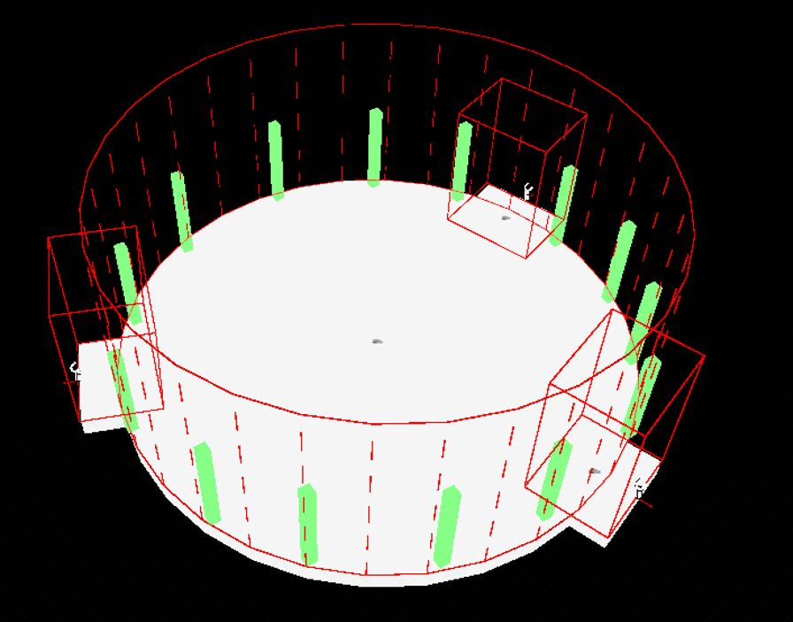

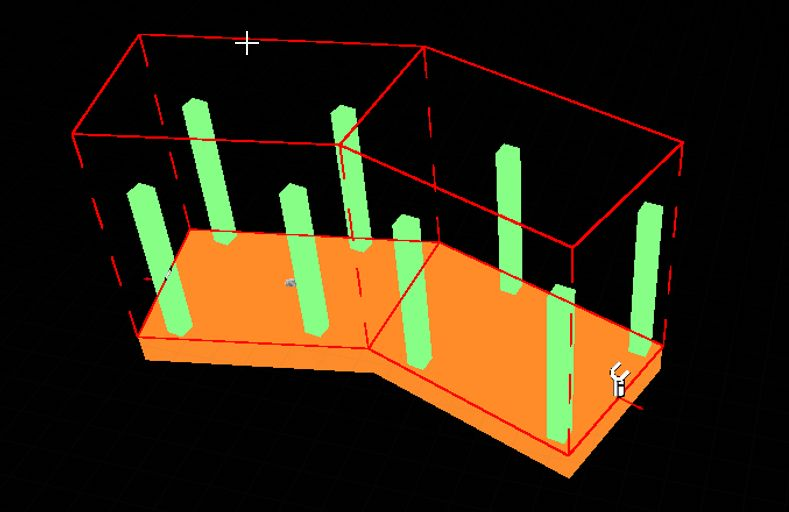

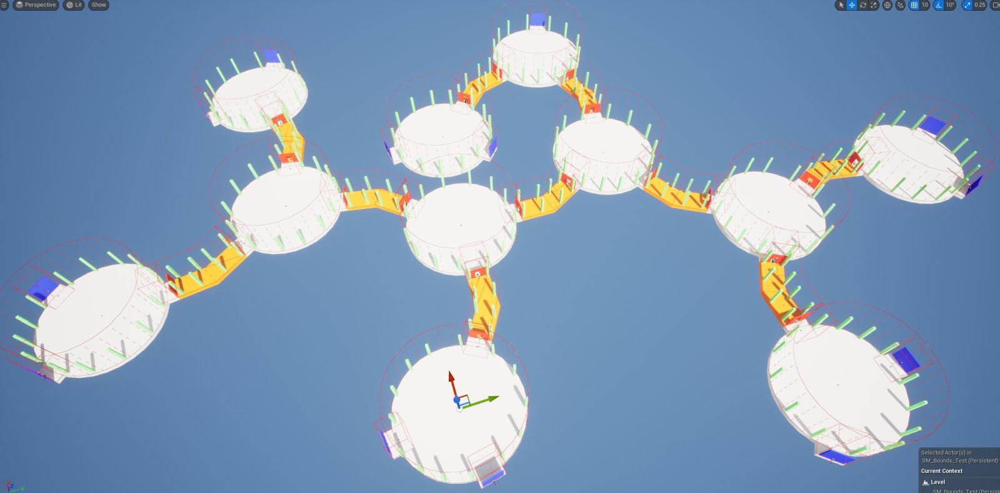

---

Open up a snap module that you designed

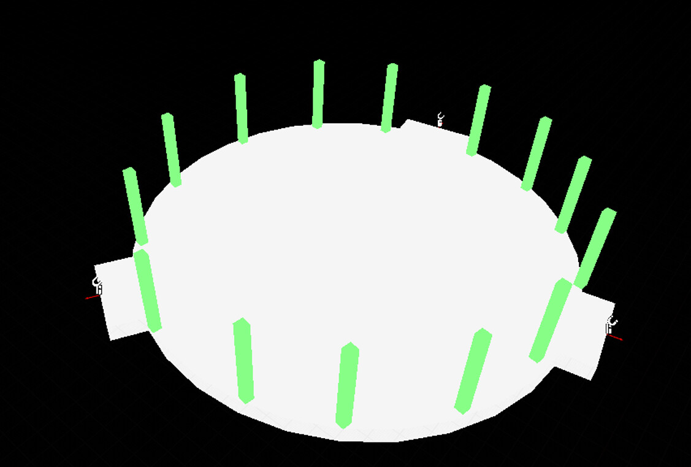

Drop in a `Snap Map Module Bounds` actor on to the scene. You can have as many of these actors as you like in the module to cover the bounds

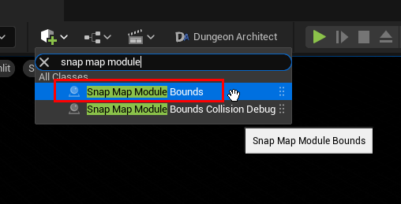

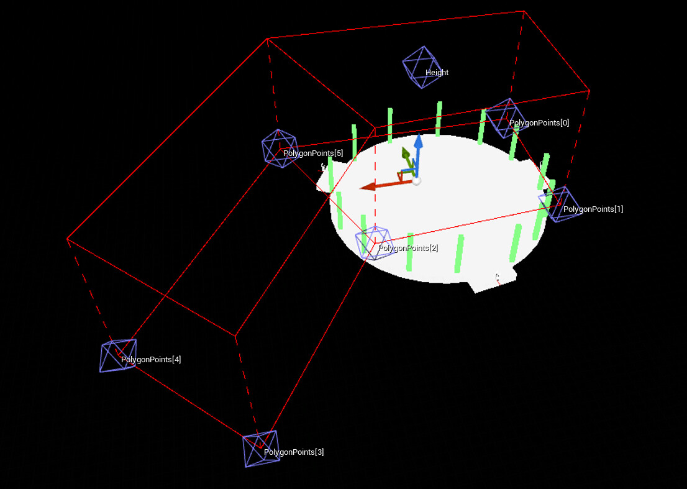

## Circle Shape
By default, it's set to a polygon.   Lets change it to a circle

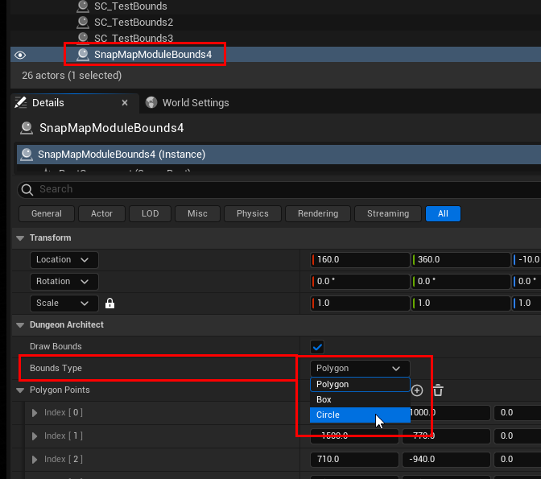

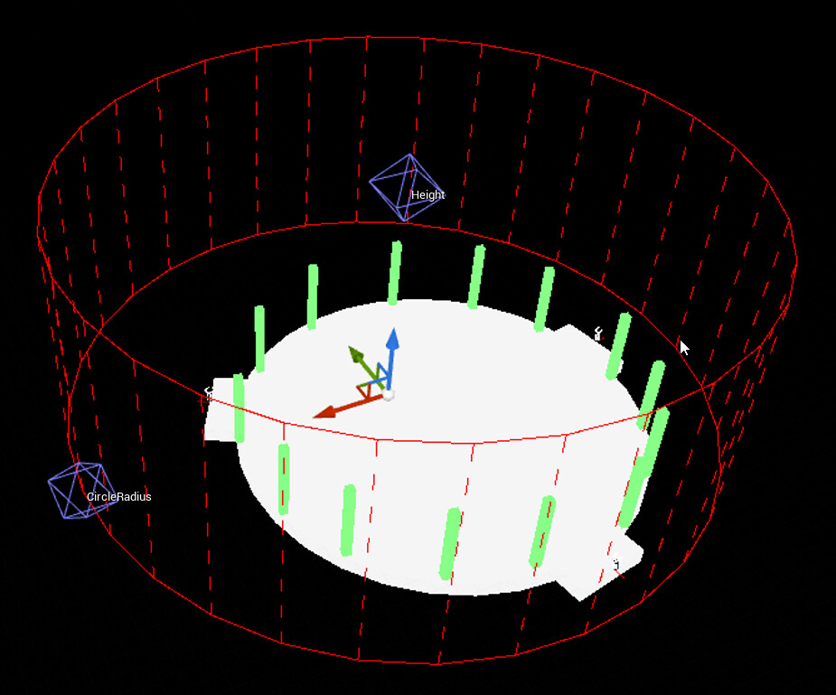

Move the bounds accordingly.

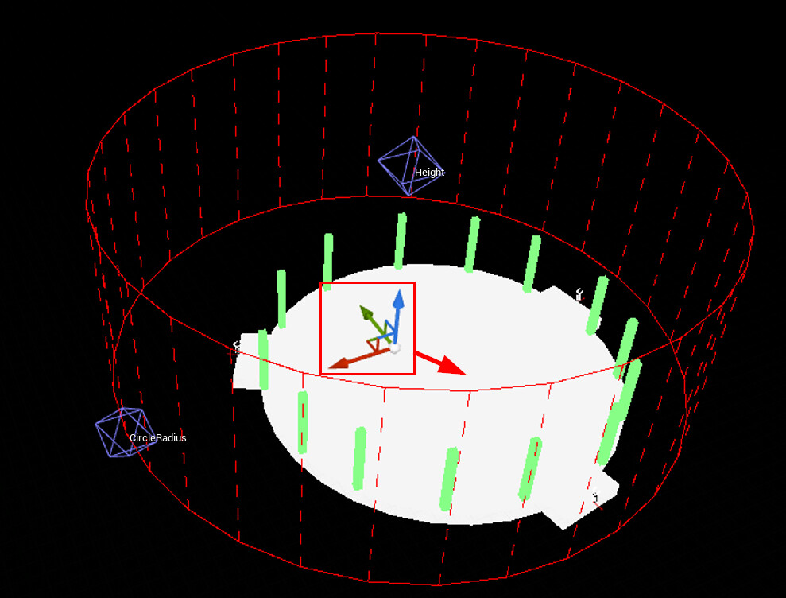

Grab the radius handle and adjust the radius

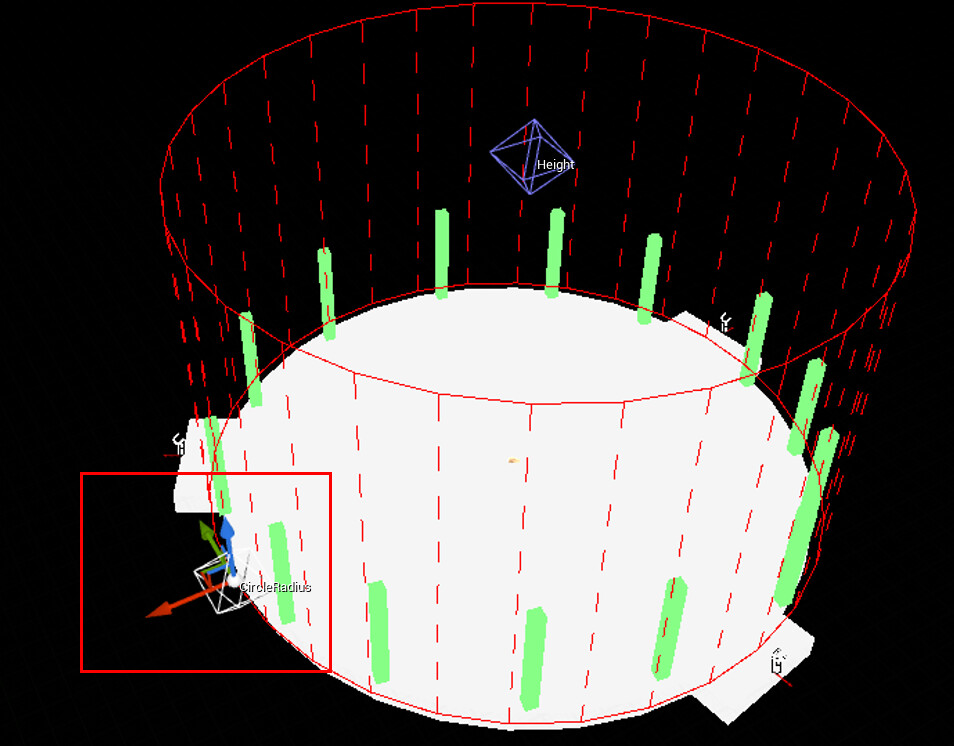

Adjust the height with the height handle

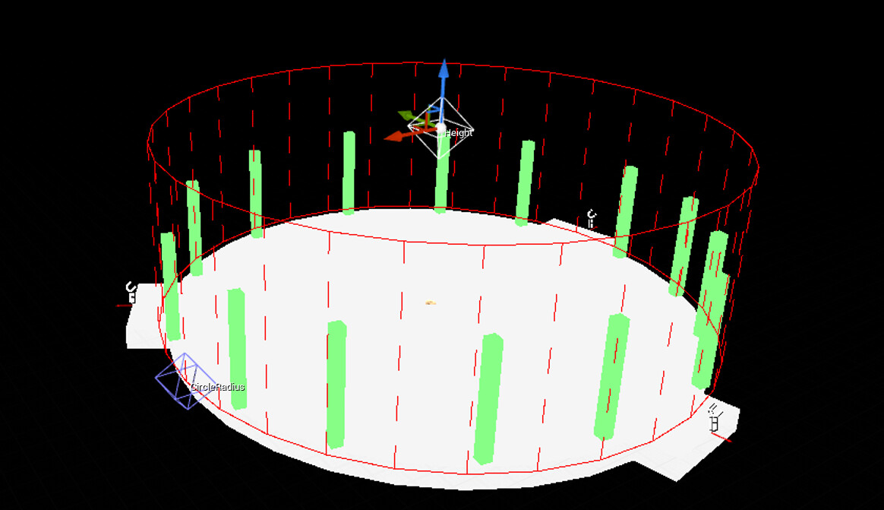

## Box Shape

Add another bounds and set the shape to Box this time.   Adjust it so it aligns on one of the door opening

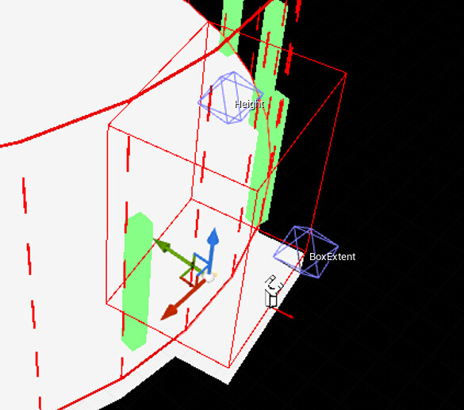

Do the same of the other 2 doors

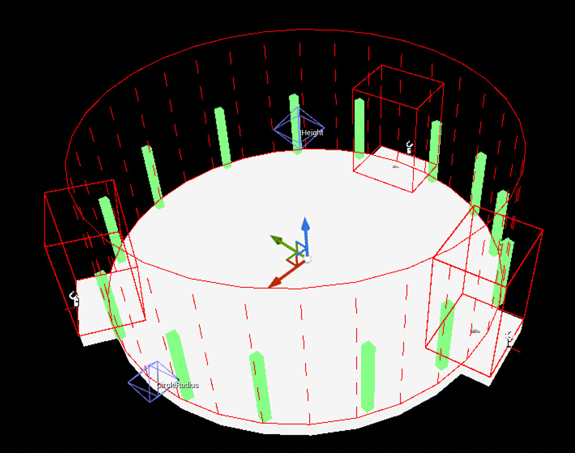

> IMPORTANT: After you modify the bounds, it's important that you rebuild the [Module database cache](https://docs.dungeonarchitect.dev/unreal/snap-flow/register-modules)

## Polygon Shape

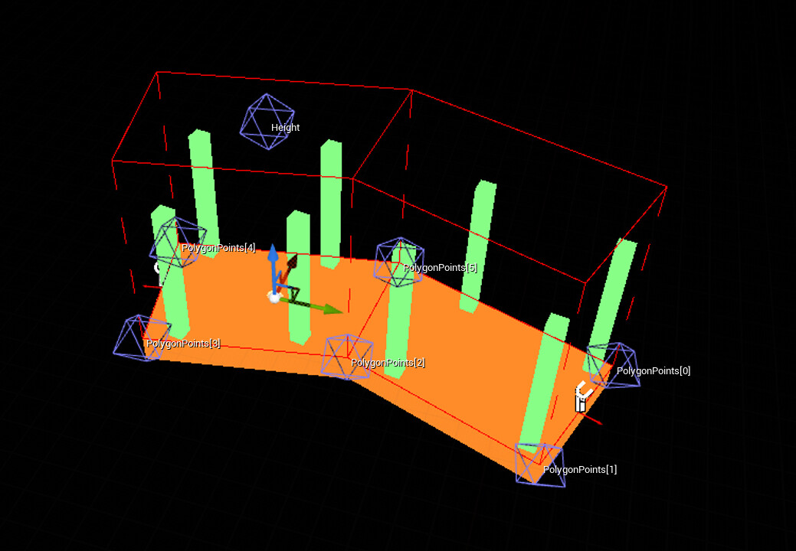

Use the polygon shape to wrap your dungeon bounds using a polygon.   The polygon should not self intersect. If it does, the system will ignore the bounds, since the shape is invalid and the bounds would not be shown

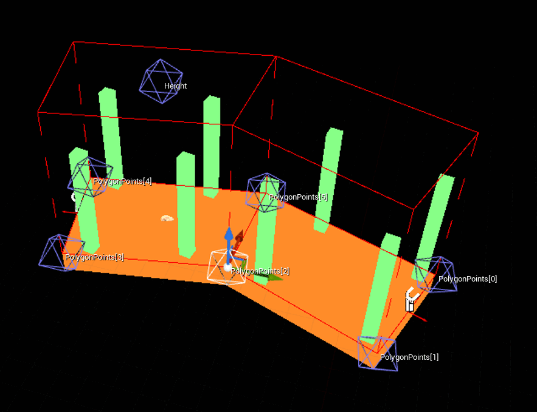

> Click the image to play

It would show a dashed border like this:

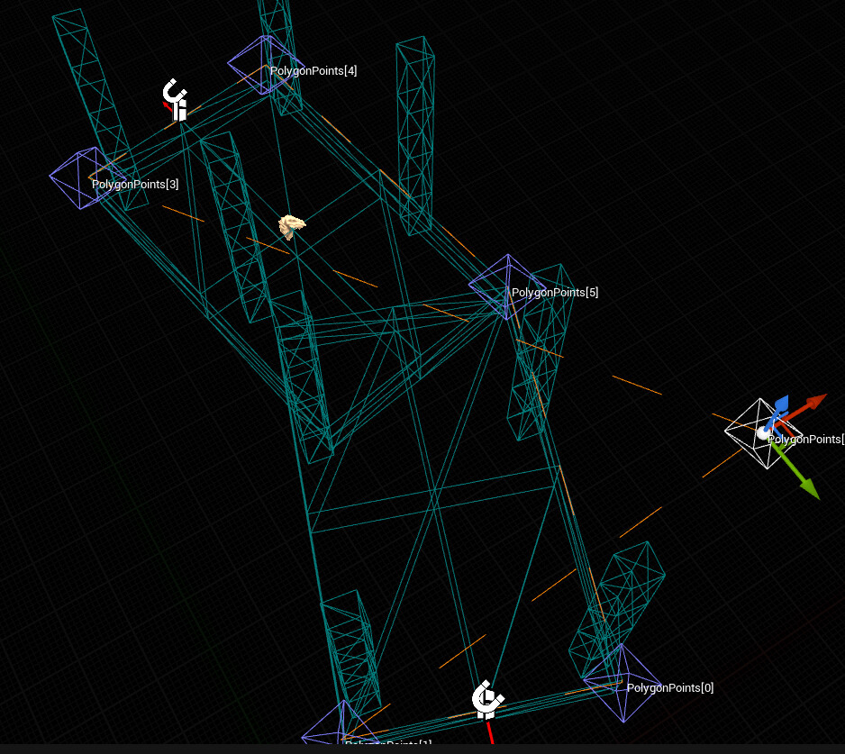

You can provide a concave polygon and DA will automateically split it into several convex shapes (so collision check is faster)

## Final Notes
You don't have to go very agressive with this, just have a general bounds that cover everything and it might be ok to leave out some small stuff.   The goal of these bounds is to make sure other modules do not overlap with whatever is inside this.   Try to not have too many of these shapes as it would increase the time required to check for collision

## Sample Scene

Download: [SnapMap_Bounds_Demo.zip](https://forums.dungeonarchitect.dev/uploads/short-url/sf8NJecgYZEbK6XS9Lt6e6hMCfo.zip) (101.2 KB)

Extract and copy the folder to your Content folder. It should look like this:

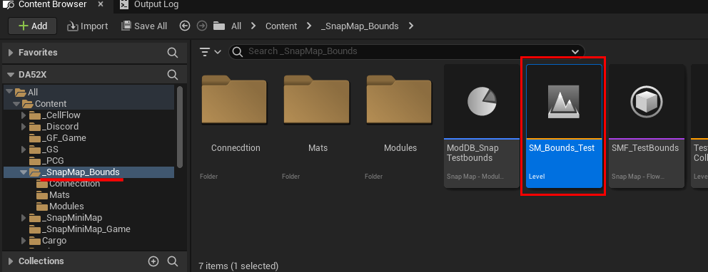
