A Dungeon Flow graph allows you to control the layout of your dungeons using Graph Grammars.  
You can generate interesting graphs with simple rules

Create a new Dungeon Flow Asset

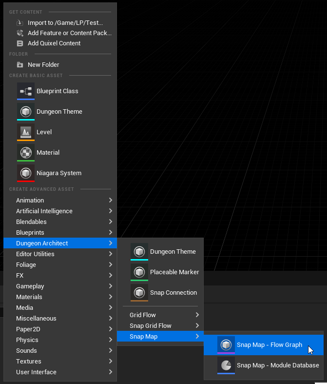

Add two new nodes **Room** and **Corridor**.  You can change the name of the nodes from the details panel.

These names map to the names you specified on the Module database (Room and Corridor)

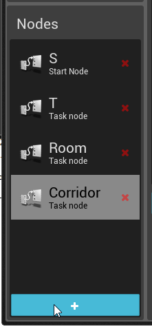

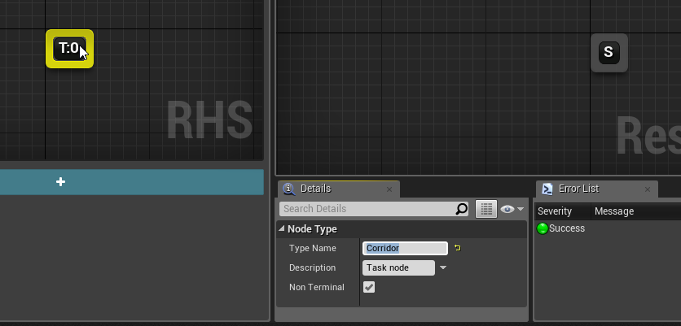

Select the *Start Rule* and on the RHS,  drop in a few Room nodes like this:

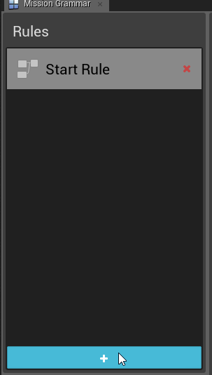

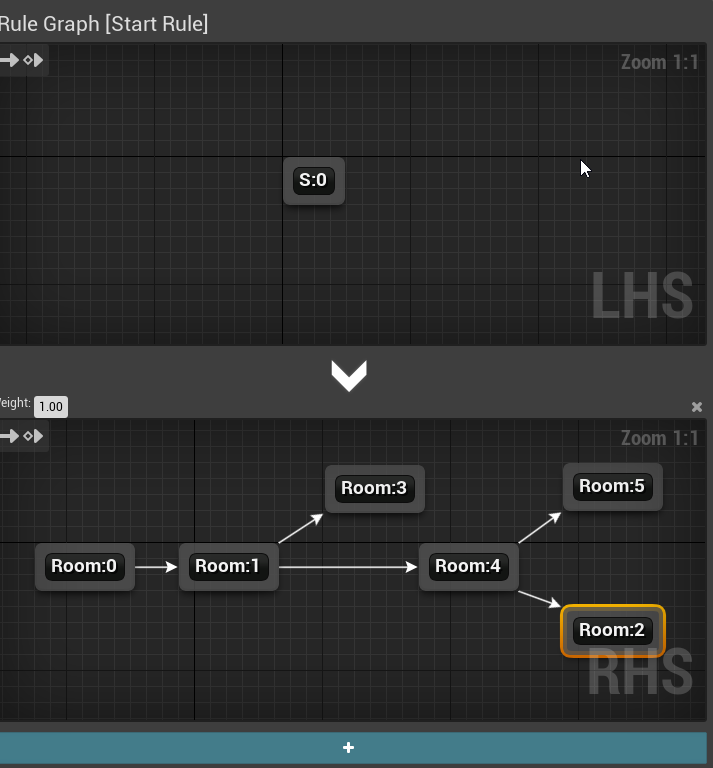

:::note
Cycles are not supported by the SnapMap builder
:::

Execute the rule and see how the final graph is generated. You do this by clicking the Run icon on the Execution graph panel

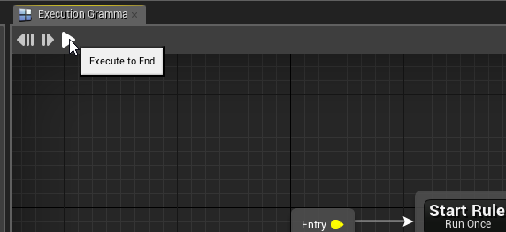

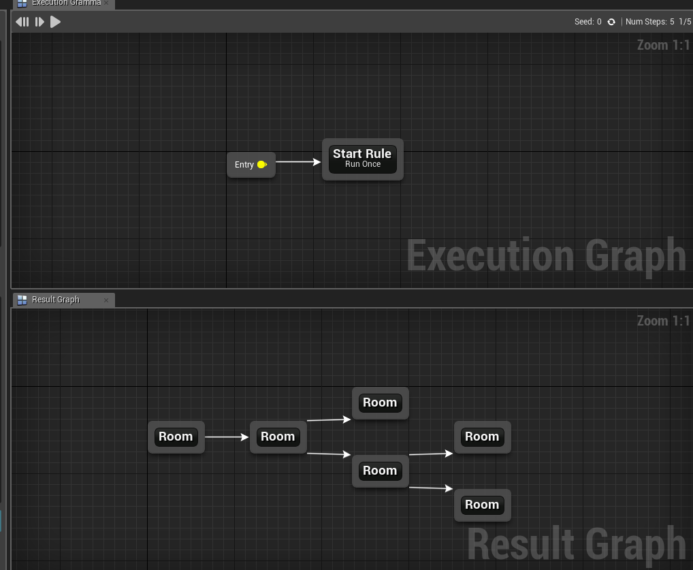

We'd like to insert Corridors between the rooms.   Create another rule and give it a name (e.g. *Insert Corridors*)

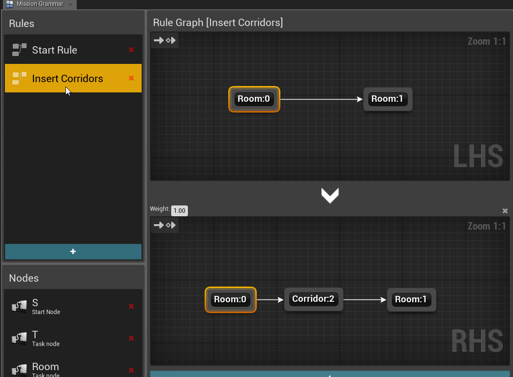

On the LHS, we want to find a patterns where two rooms are connected to each other like this (Room -> Room) and have it replaced with (Room -> Corridor -> Room)

The Graph Grammar will find a pattern you specify on the LHS and replace it with the one you specify on the RHS

The Indices on the nodes (e.g. Room:0, Room:1) are important that helps in correct mapping.   Since we properly specified 0 and 1 indices on the RHS, it knows the direction of the newly created links to the corridor.   This will be covered in detail in the full documentation soon

You control how your rules are run from the **Execution Graph**.  Drag drop your newly created **Insert Corridor** rule on to the execution graph and connect it after the *Start Rule*.

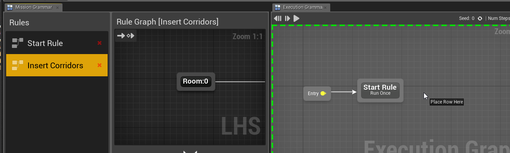

Select the newly placed node and from the details panel, change the execution mode to Iterate and set the count to 2 or 3 (This makes the rule run multiple times since the newly replaced Room nodes wont map with the adjacent older Room nodes by design and need to be run again)

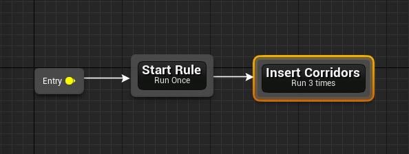

Execute the grammar and you'll now see corridors between your rooms

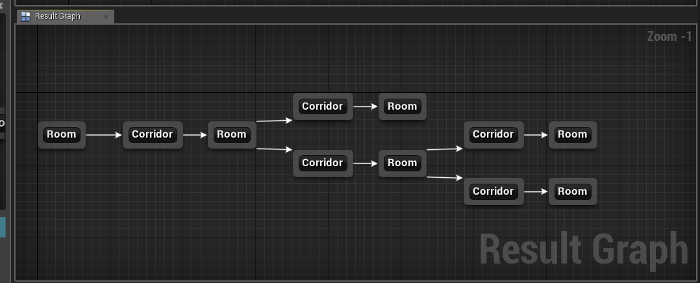

We will use this Dungeon Flow graph grammar to generate our snap dungeons
