A module is a pre-designed room. You design a module in separate level files and you specify connection 
points (usually doors) that should be used for stitching the doors together.

## Create Module Level File

Right click on the content browser and create a new level file (Right click so the new level file is empty
as we don't want the skybox, lights etc)

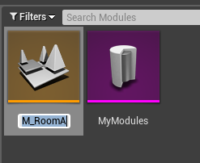

These level files are empty and don't have any lights.  It order to make it easier to design our rooms in 
these levels,  We'll create a new level (temporary) and edit our module level files from there

Create a new level from *File > New Level* and choose the default one

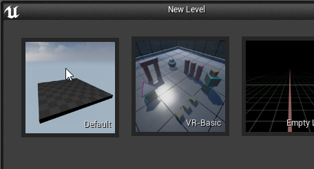

Open Levels window

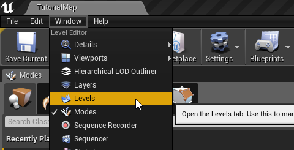

In the Levels window, drag drop our module level and double click on it to make sure it is the currently 
selected level.  If the level is currently selected, all dropped actors will be placed on it

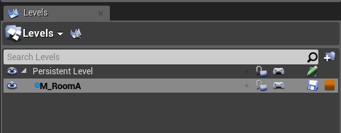

## Design your Modules

Drag drop and design your module.  Dungeon Architect comes with a rapid prototyping toolset that makes
it easy to quickly build your rooms.  We will use this in the sample, however feel free to use your own assets

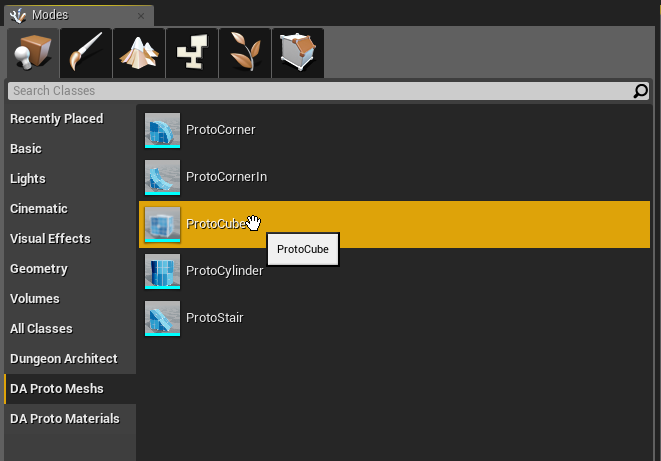

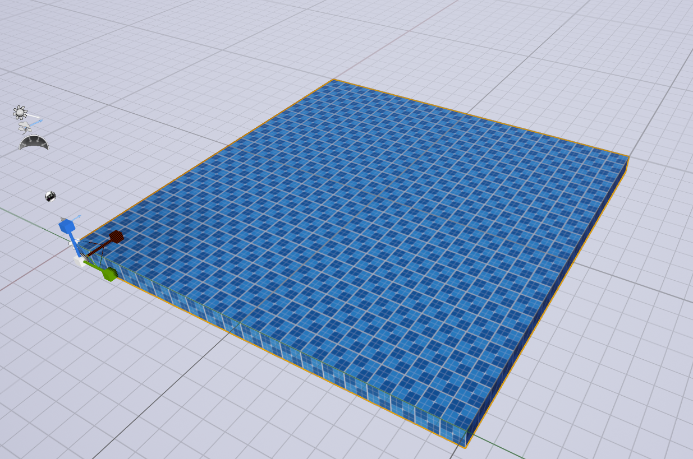

Make sure the scale and movement is snapped to something like 1 and 100 respectively.  This makes the adjustment easier

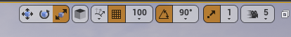

Complete the design of your room.   We've left holes where there could be a possible entry / exit.  
Here, we will place a connection actor to let Dungeon Architect know that it can stitch other modules from this location.

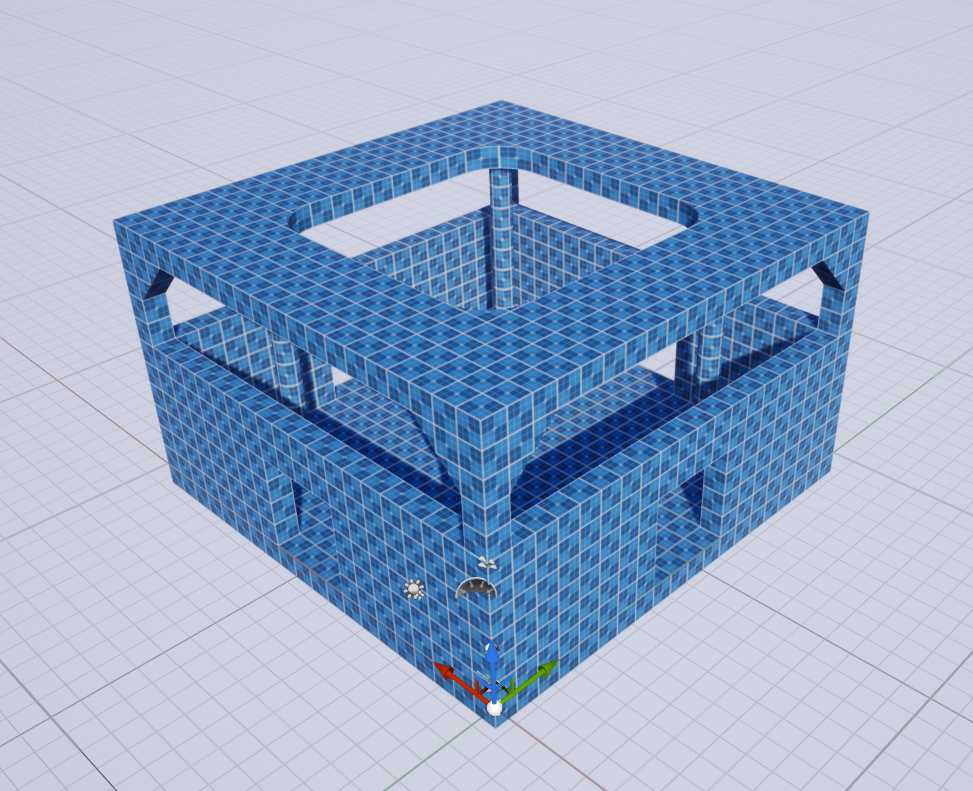

Make sure all your meshes are inside the module level and not the temporary level we created.
Do this by clicking the eye icon on the Levels window and make sure everything dissapears if we hide the module level

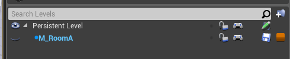

Go ahead and design another module for our corridor.

> Make sure you are editing the correct level file by double clicking on the level name in the Levels window (it should turn bold)
{style="note"}

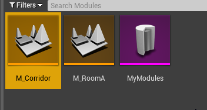

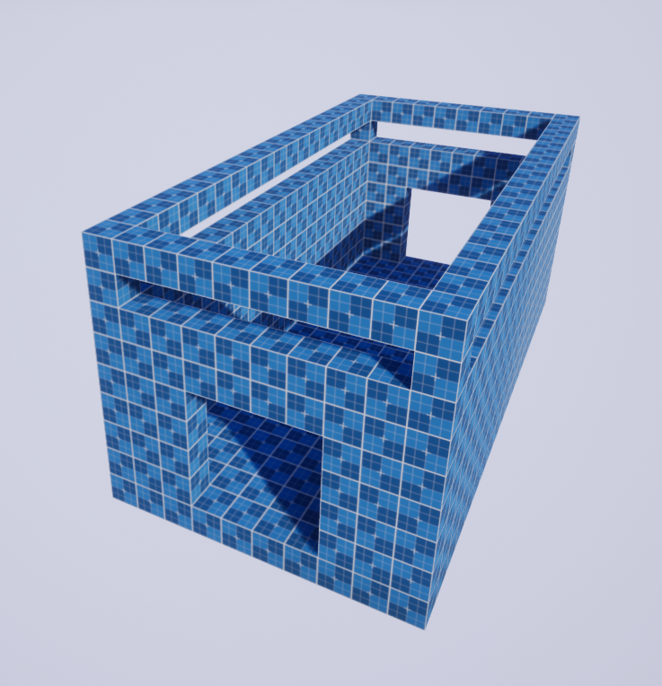
