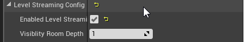
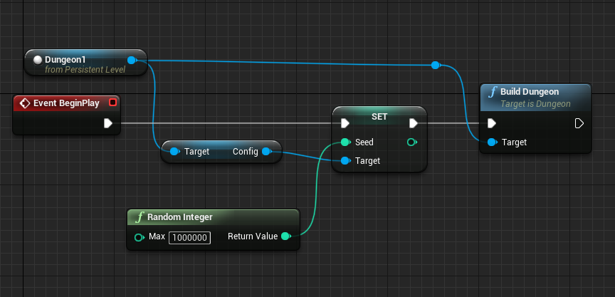
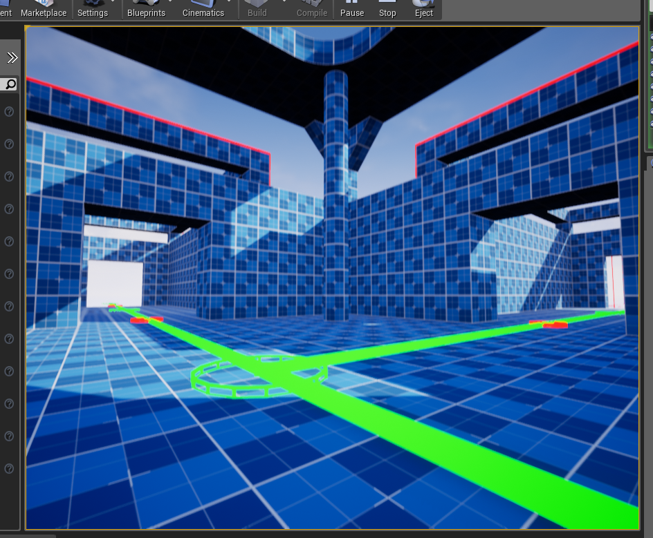

The snap builder supports Level Streaming. It would Stream in and out the module level files, depending on the layout graph and customizable visiblity depth

Select the Dungeon Actor and enable level streaming

Build a new Dungeon at runtime on BeginPlay of the Level's blueprint

:::note
You can get the reference to the Dungeon1 node in the above blueprint by first selecting the dungeon in the level editor, then right click on the level blueprint
:::

Destroy your existing dungeon. Hit play and the nearby modules will be streamed in / out as you move through dungeons.  This helps with maintaining a smooth framerate with fully dynamic lighting

