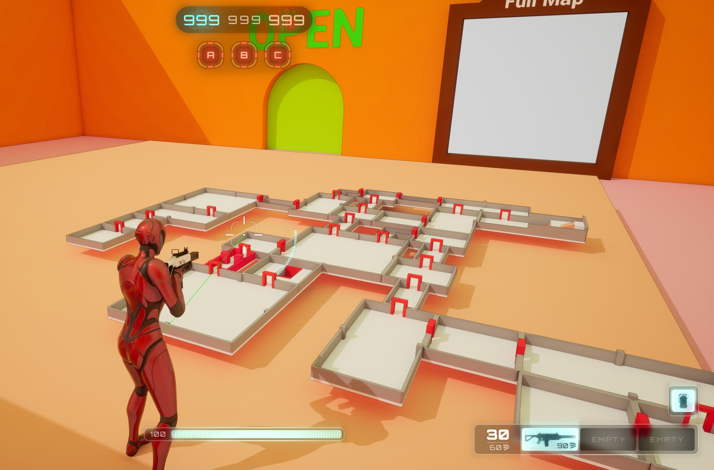
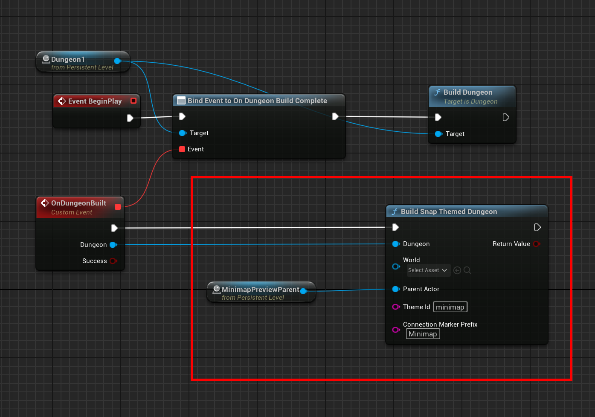
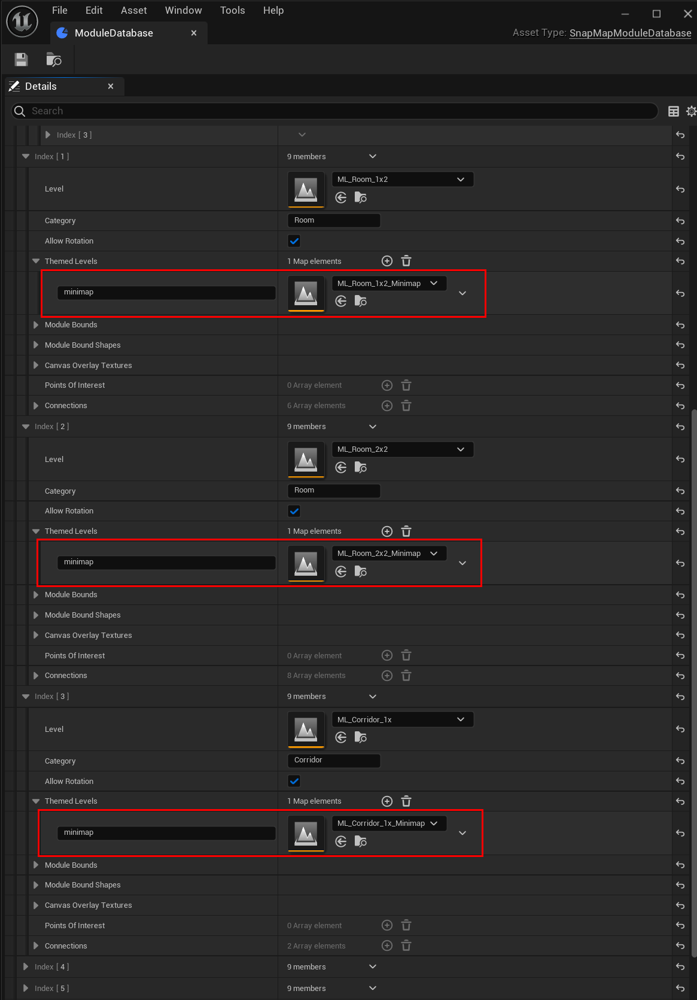
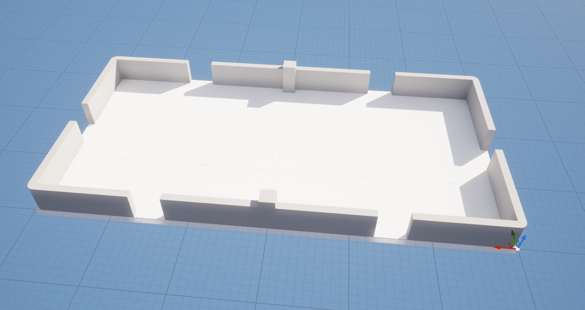
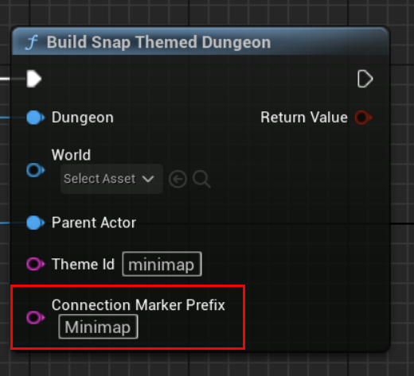
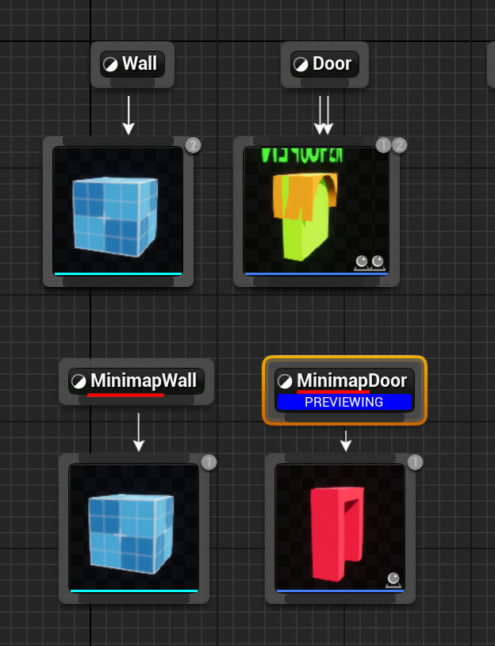
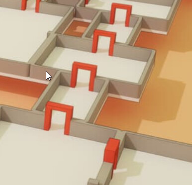

This post shows you how to create a 3D snap dungeon minimap.   You can create this preview dungeon in the same world (like a hologram sitting in some room), or in a separate world to render out in a render texture

To spawn a 3D minimap on the world, just call this function after your dungeon has been fully built:

The parent actor node controls where you'd like to spawn this.    Update the scale, rotation and location accordingly

You can spawn this in an other world, and then render it out in a render texture for your HUD, if you specify the World input parameter (more on this later below).    Rendering it in another world means you don't have to worry about it getting in the way of your existing world geometry, and you can use a different lighting model in that world.

## Minimap Modules
You can render out your modules in a different theme.   Think of this as a simplified verison of each  module, as you wouldn't want detailed world geometry rendered here.     Here's I've specified `minimap` and in the module database, for each module entry, I've created a simplified module to be used with the minimap and registered it there

This is how a minimap module looks like:

Notice it doesn't have connections defined.  Connections are not needed here, the minimap will be built based on the existing dungeon layout, so it should just match the base module's layout

## Minimap Connections

The `Connection Marker Prefix` input in the `Build Snap Themed Dungeon` node lets you have a different door and wall meshes on your minimaps.   Specify a prefix here and it would look for this door in the Snap Connection's theme graph

So if you specify `Minimap`,   it would look for `MinimapDoor` instead of a `Door`.  It would do the same with `Wall`
