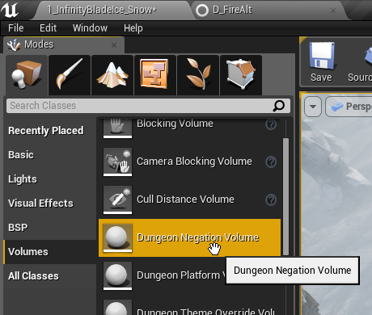
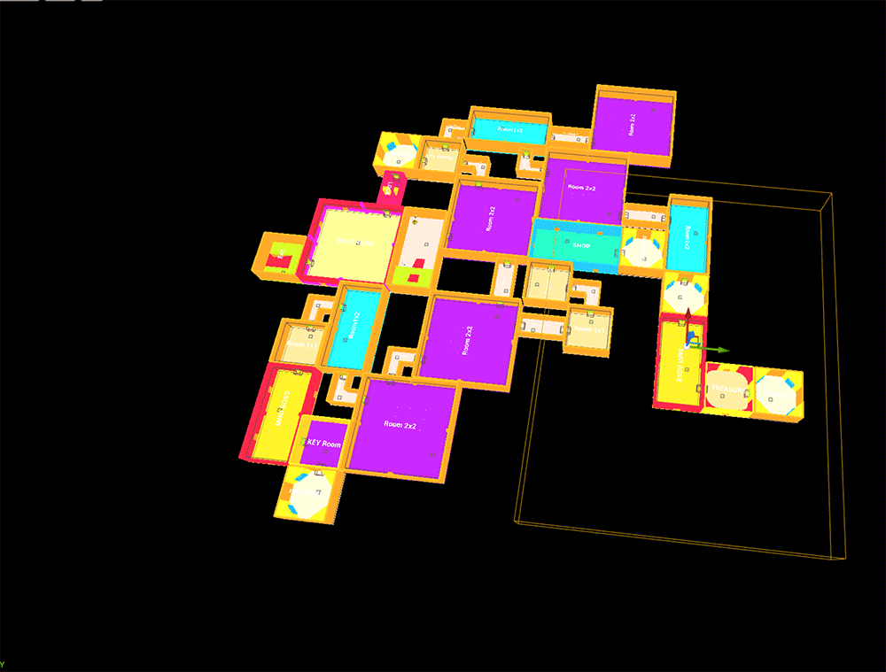
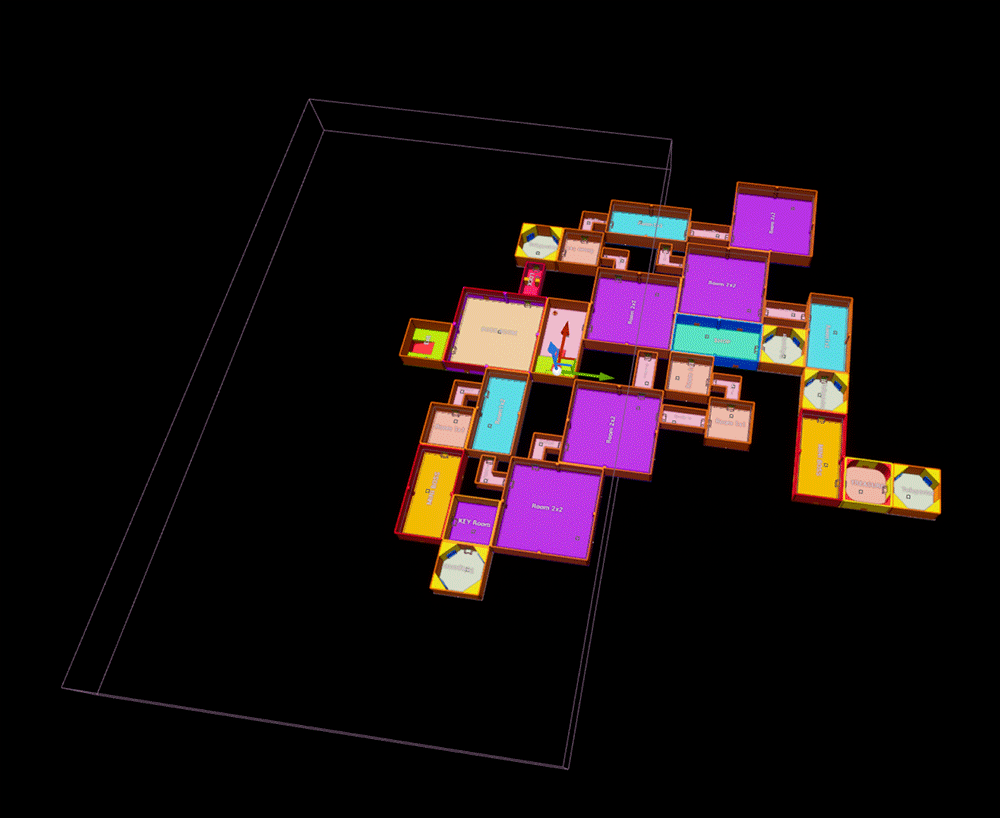
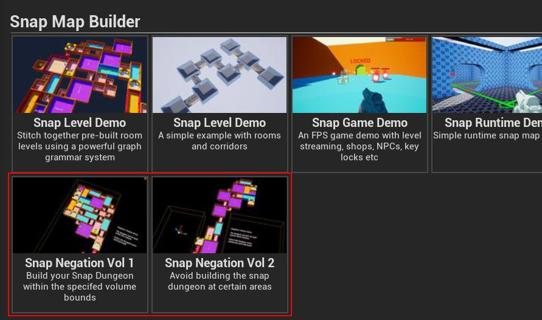

You can control where your dungeon grows by using Negation Volumes.  This allows (or disallows) the 
growth of a dungeon at certain places.  Use this to make sure your dungeon fits in a certain play area, 
or make sure it is not built in certain areas

Drop in a Dungeon Negation Volume actor on to the scene and scale it to the desired size

Select the Negation Volume and inspect the properties.   Assign the dungeon actor so this volume can work on that Dungeon

Hit build and the dungeon won't build in that location

> Click the image to play

If the flag ``Reversed`` is checked in the properties, then the dungeon will be constrained within the volume bounds

> Click the image to play

Check the samples in the Launch Pad window

