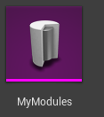
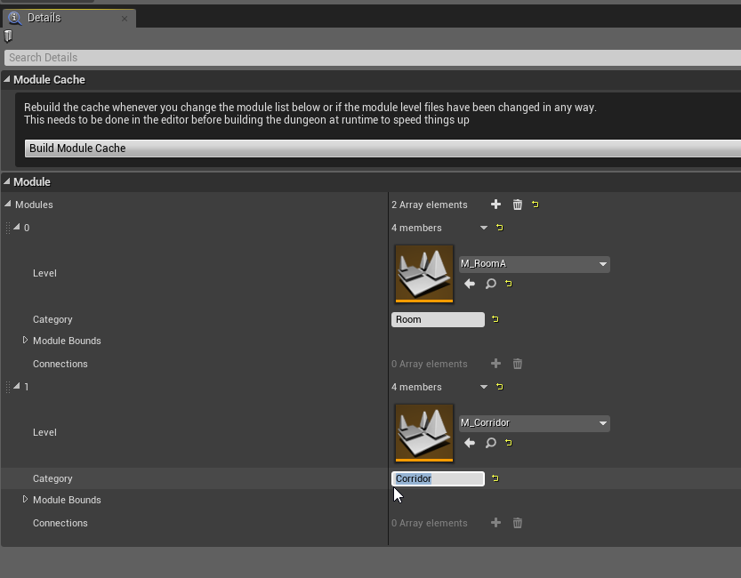
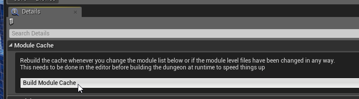

It's time to register our modules in the Module Database.

Open the module database editor

Click the **Build Module Cache** button after you've modified the module database.  This is an optimization step so your dungeons build fast at runtime. You'll get a warning on screen DA if detects that they are out of date

:::warning
Do not forget the above step. It is important
:::
