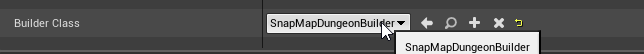
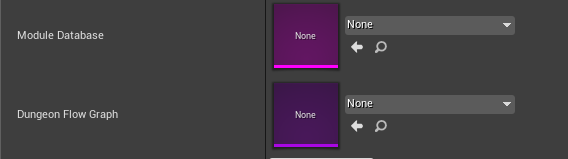

The Snap Builder generates a dungeon by stitching together pre-built rooms. These rooms are designed in individual level maps.   The rules for stitching them is controlled by Graph Grammars

## Prepare the dungeon actor

Create a new scene and drop in a Dungeon Actor

Select the Snap Map builder

We'll need to fill this later on

