# Build Dungeon

It's time to use everything we've created to build a dungeon

## Create Theme file

Create an empty theme file somewhere in the content browser.  We'll visit this later to spawn items in our modules
(like NPCs, Spawners, Pickups, PlayerStart etc.)

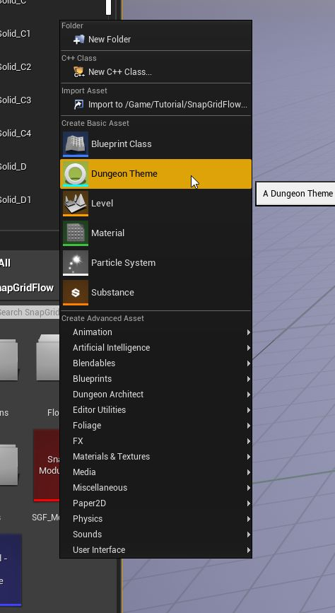

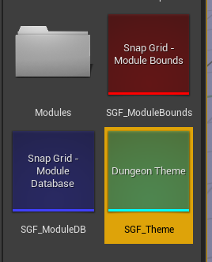

## Setup Dungeon Actor

Create a new Level

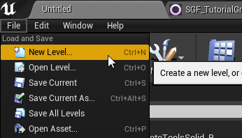

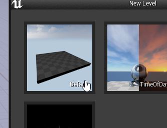

Drop in a `Dungeon` actor

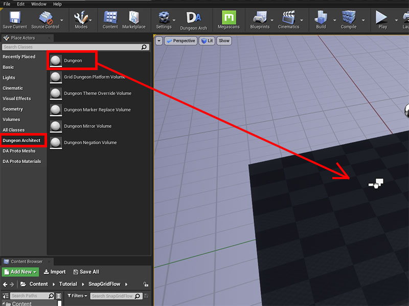

Select the actor and reset the transform

Change the Builder type to `SnapGridFlowBuilder`

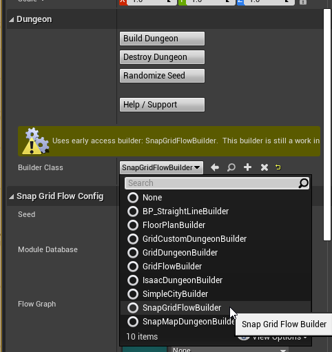

Assign the `Module Database`, `Flow Graph` and `Theme` assets

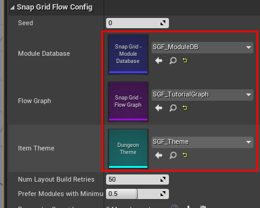

Click the `Build Dungeon` button

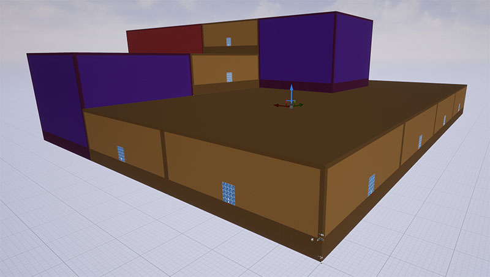

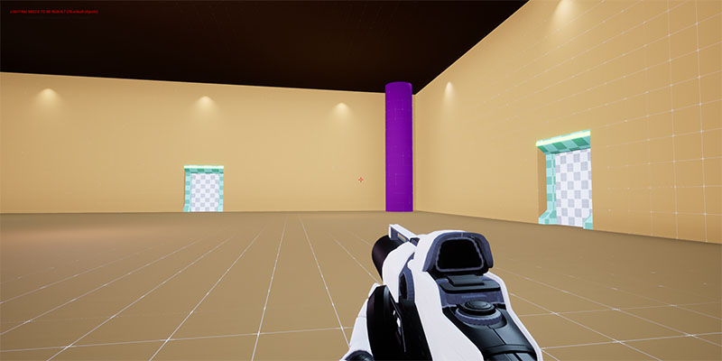

## Debug Draw

Select the `Dungeon` actor and enable `Debug Draw` to see the flow graph overlay on the world

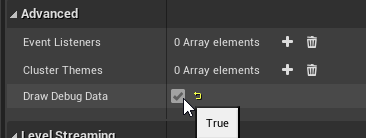

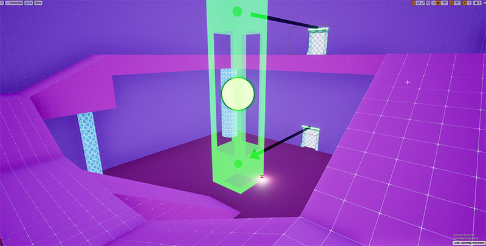

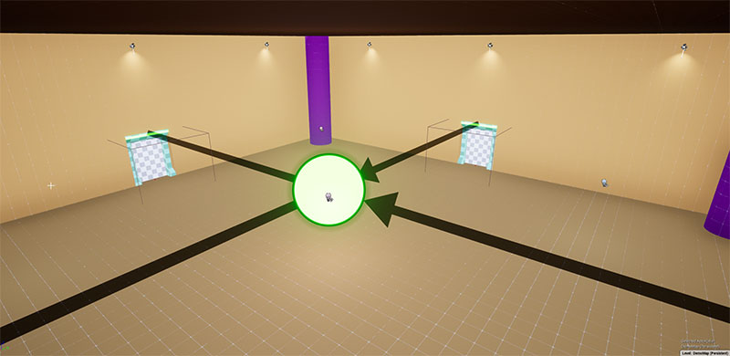

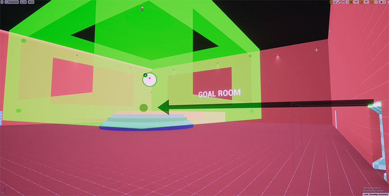

## Save Map

We've set up our dungeon actor in this map. Save this map, we'll revisit this later
