A `Connection` is a stitching point that the Snap framework uses to join rooms together

## Create a Connection Asset

Create a new `Snap Connection` asset in the content browser

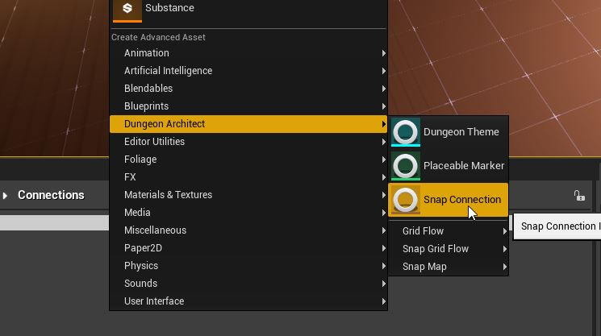

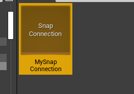

## Connection Editor

Double click the newly created asset to open up the `Snap Connection Editor`

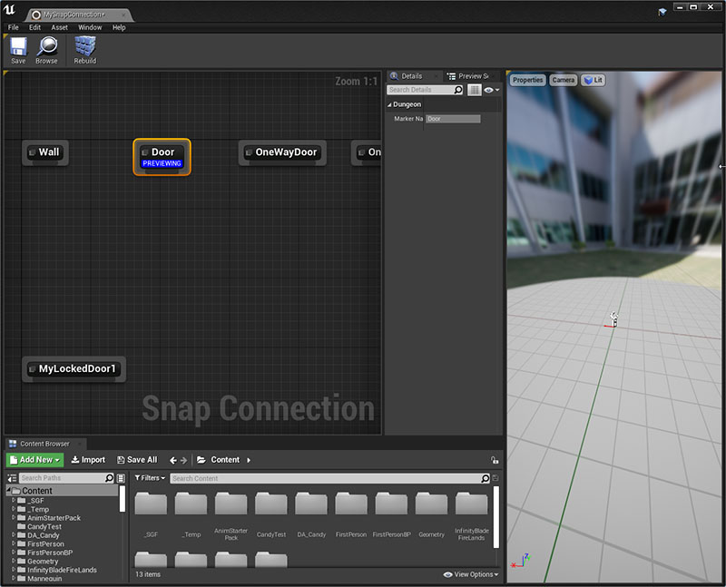

In this editor, you will drop in your door and wall blueprints and link them up.  

## Setup Door Asset

There's a simple Door blueprint that
comes bundled with the samples.   We'll use that here, however, feel free to use your own door blueprints

To access the plugin's sample contents, enable it from the Content Browser's View Options

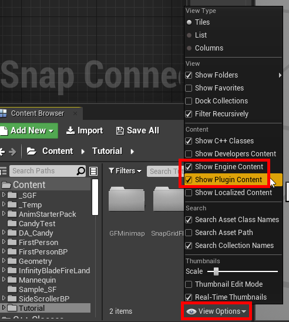

Navigate to `Dungeon Architect Content > Showcase > Legacy > Samples > DA_SnapGridFlow_FPS > Snap > Connections > DoorArt` and 
drag-drop the `BP_SGF_Door` asset to the graph 

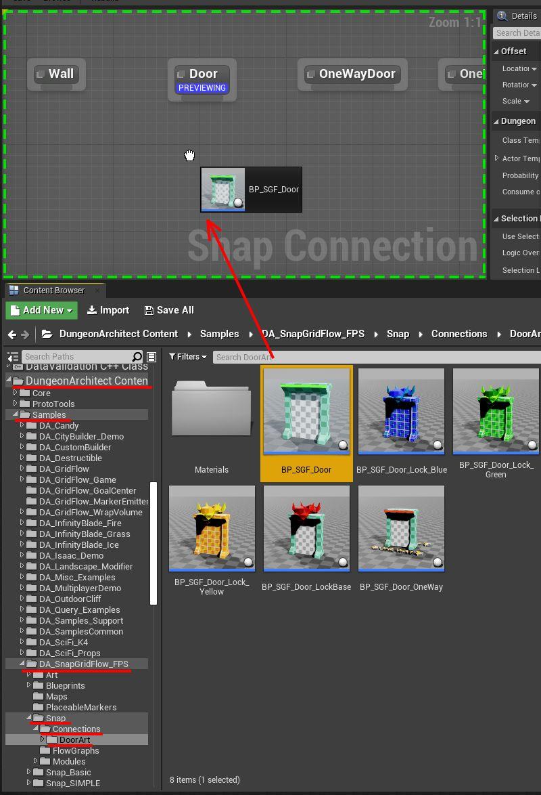

Link them up with the `Door` marker node

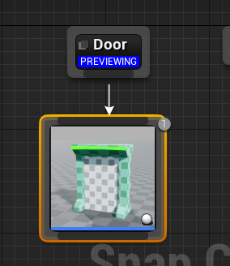

Click the `Door` Marker node and make sure the blue `PREVIEWING` message is shown.  This will allow you to preview
everything under this node in the 3D viewport

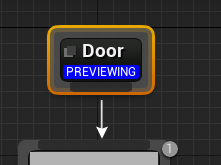

Have a look at the preview viewport, and you'll see that the orientation is incorrect, the red arrow should point away 
from the door/wall,   (we can't see the red arrow as it is inside the door)

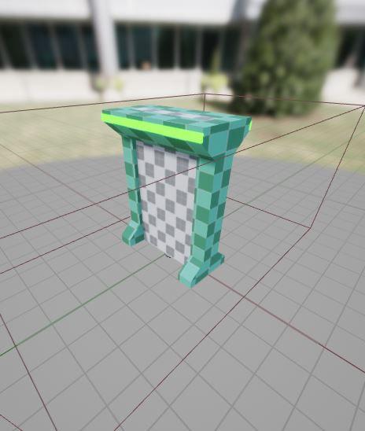

Select the Door Node and rotate it by `-90` degrees along `Z`

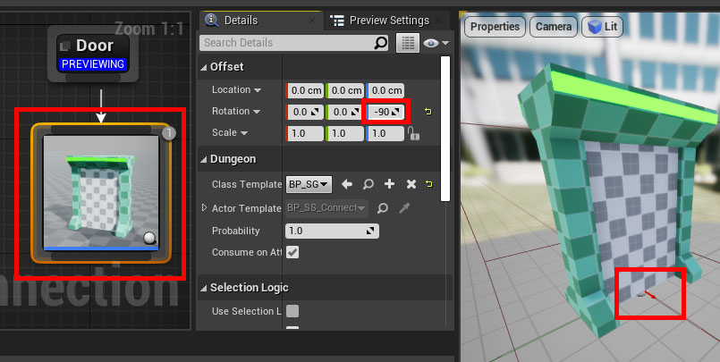

Make sure the red arrow is aligned correctly as shown in the image above

Our door setup is complete. 

> The door asset is `400` units wide and `500` units tall.  This will nicely cover up
the connection gaps we created in the module in the previous section
{style="note"}

## Setup Wall Asset

While building the dungeon, if there's nothing stitched on the other side of a connection, it will be walled off 
with the asset you provide under the `Wall` marker node

Select the `Wall` marker node so we can preview its content in the 3D viewport (make sure you see the 
blue `PREVIEWING` message) 

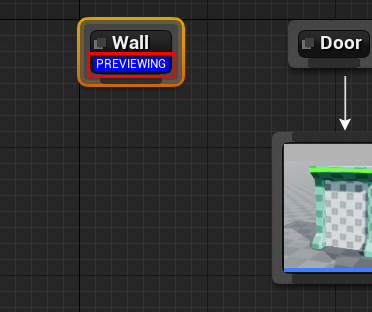

For the wall mesh, we'll use a `Proto Cube` mesh that comes bundled with Dungeon Architect
(feel free to use your own asset)

To do this, resize the connection editor window a bit and drag-drop the `ProtoCube` mesh from the main level editor
window on to the connection editor

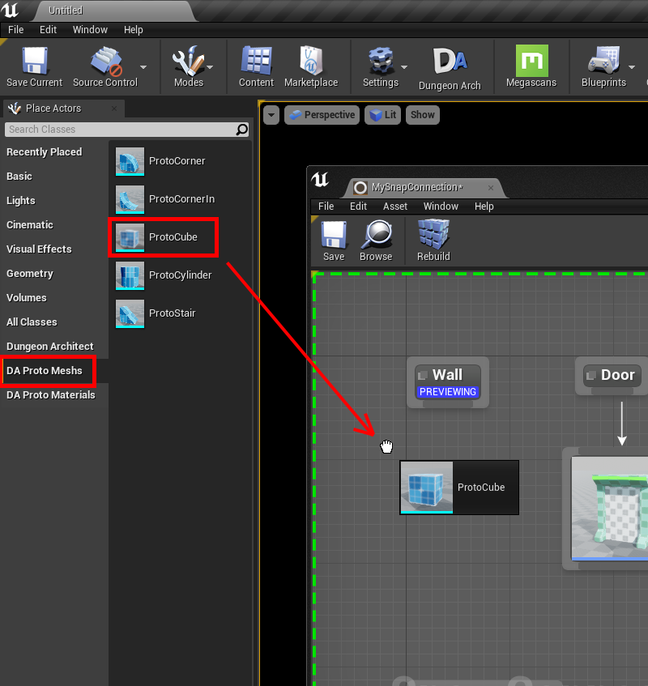

Connect them up

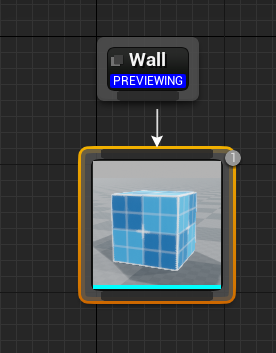

Have a look at the 3D preview viewport

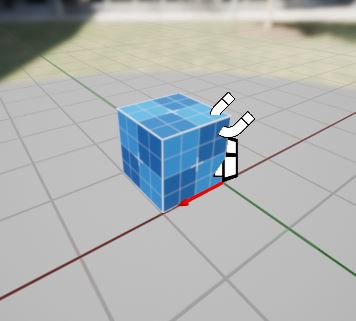

We need to scale this mesh so that it is `400` units wide and `500` units tall
(since that's the gap we've left near the connections on our module design)

The cube mesh is `100x100x100` units in size, so we'll set the scale to `(1, 4, 5)`

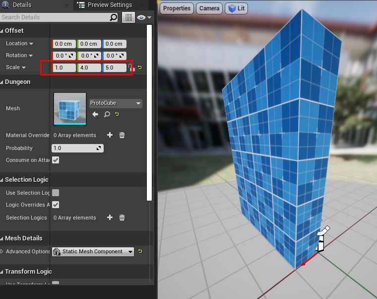

The wall should be moved appropriately so that:
* The red arrow is at the bottom-center of the wall
* The wall should be behind the red arrow's origin point

Set the Location to `(-100, -200, 0)`

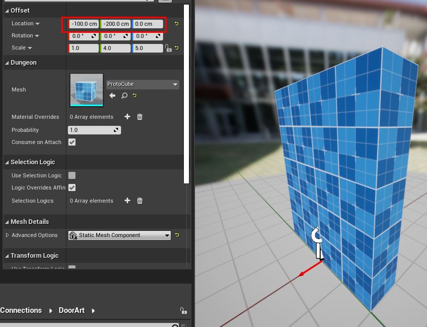

The wall setup is complete

## Setup One-way Door Asset

Some doors will be promoted to one-way doors.  This is done so that the player doesn't bypass a locked door and
enter through another nearby door  

You'll need to provide a blueprint that opens only from one way.    We'll use the sample one-way door that comes 
bundled with the plugin

Navigate to `Dungeon Architect Content > Showcase > Legacy > Samples > DA_SnapGridFlow_FPS > Snap > Connections > DoorArt` and
drag-drop the `BP_SGF_Door_OneWay` asset to the graph

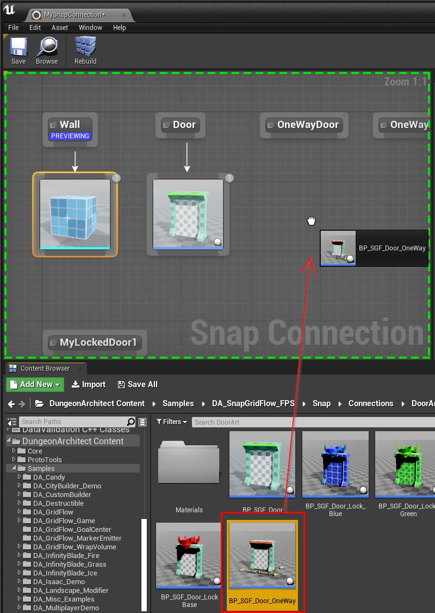

Link it to the `OneWayDoor` marker

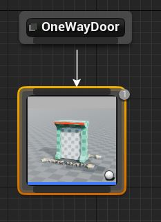

Select the `OneWayDoor` marker node to preview its contents in the 3D viewport

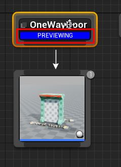

The orientation of the door is incorrect.  Rotate along `Z` by `-90` so the red arrow points in the 
correct direction of the door

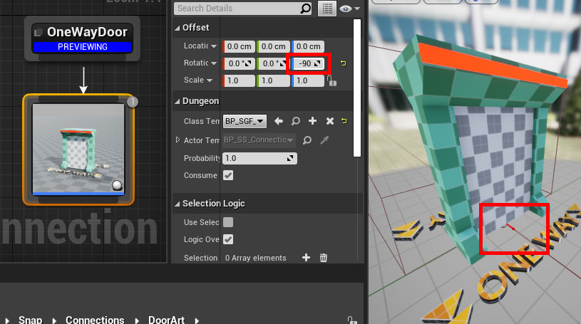

The one-way door setup is complete

Save the Connection Asset

## Place Connections on Modules

Open up the Module map file we've created earlier

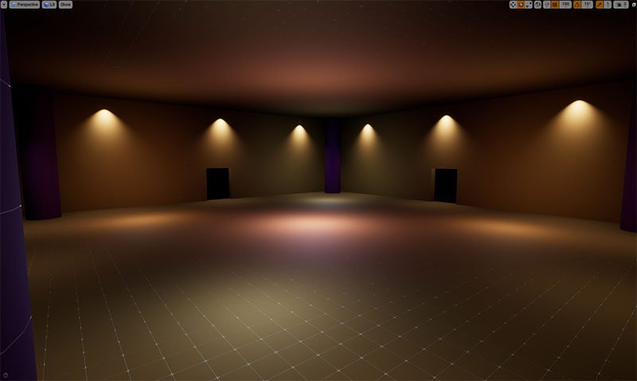

Switch to unlit mode and in the level viewport, move to one of the connection opening we've created earlier 

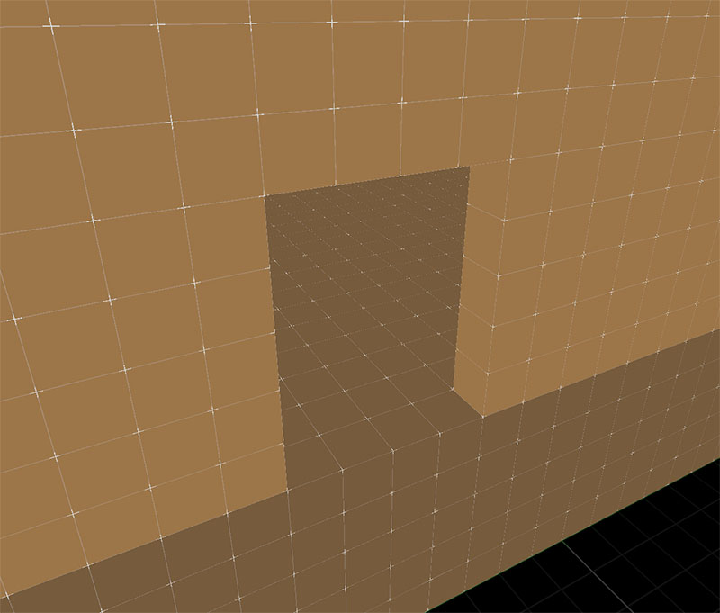

:::note
Make sure your snap settings are enabled, so that it is easier to align the objects

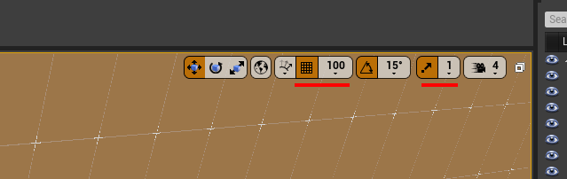
:::

Drag and drop the Connection asset on to the scene, somewhere near the door opening

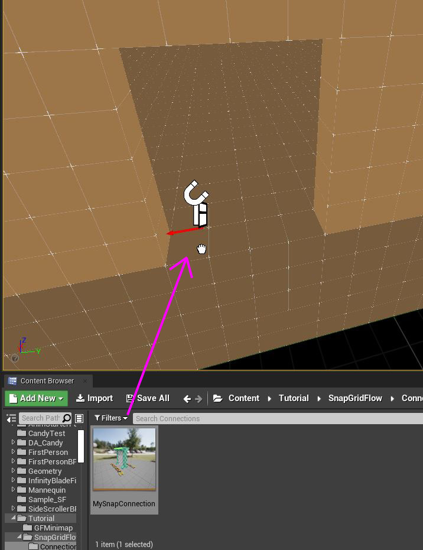

Select the connection actor that was just created and move it to the bottom-center of the door opening 
(the origin of the red arrow should be at the blue door indicator)

Also, rotate it so that the red arrow points outwards, as shown in the image below

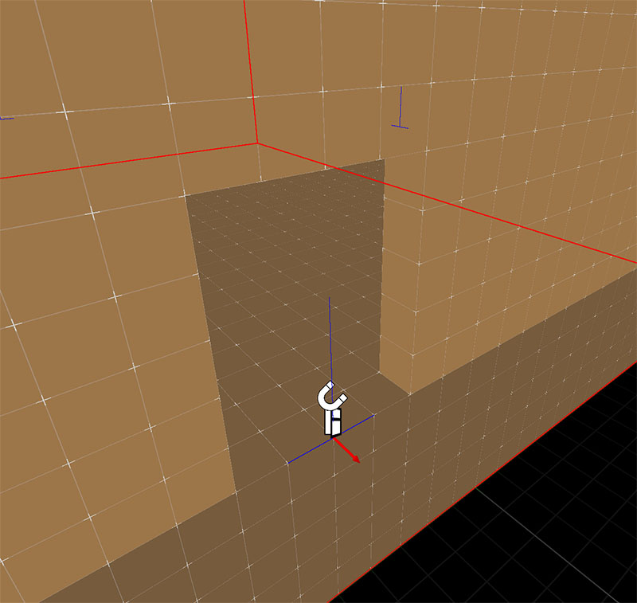

Repeat these steps for all the four door openings

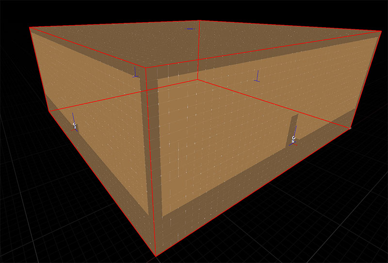
