# Create Spawn Room

We're going to create a spawn room and place a marker there to spawn the `PlayerStart` actor

## Create Module

Create a spawn room module like before and leave a few connection points open

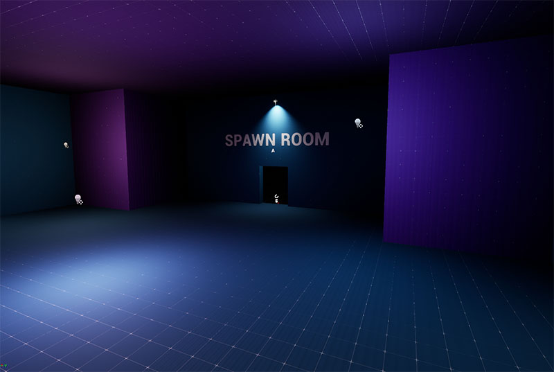

In this example, we've created a `1x1x1` spawn room with a single connection point

## Placeable Marker for SpawnPoint

### Create Asset

We want the theme engine to spawn a PlayerStart actor in the spawn room.  Create a placeable actor asset named 
`PM_SpawnPoint`

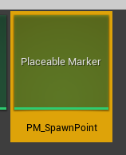

Open the editor and add a marker entry named `SpawnPoint` to the *Marker Names* list

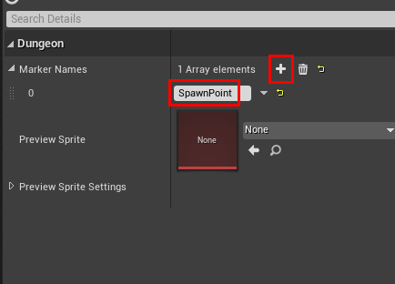

> We set the marker name to `SpawnPoint` because this is what was specified in the flow graph's `Create Main Path` node
> 
> 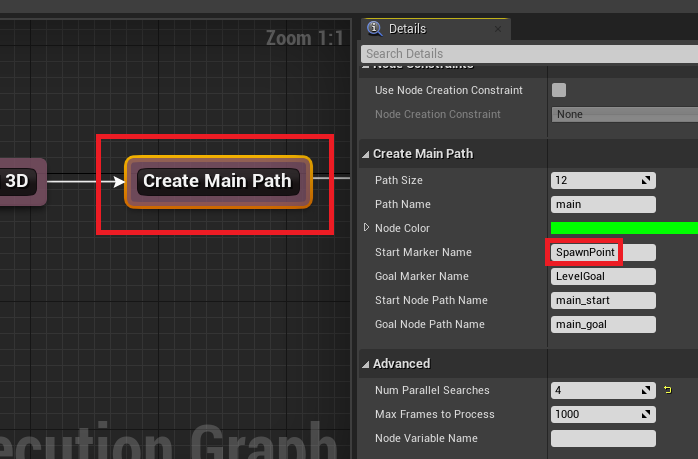
{style="note"}

Optionally specify a preview sprite for the spawn marker

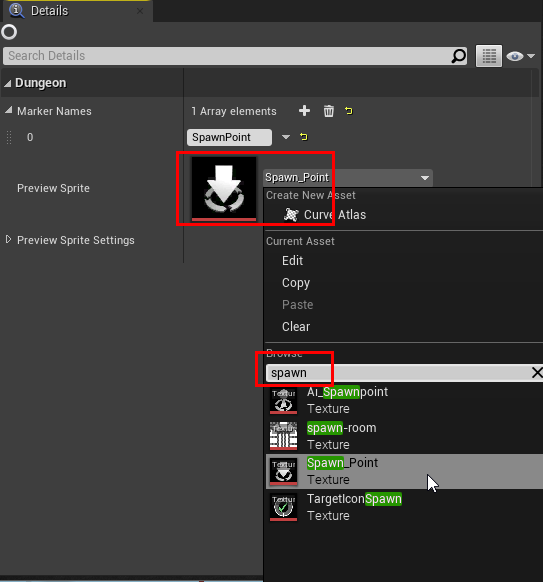

Save and close the editor

### Add to Spawn Module

Open the Spawn Room module map file and drop this placeable marker asset somewhere appropriate

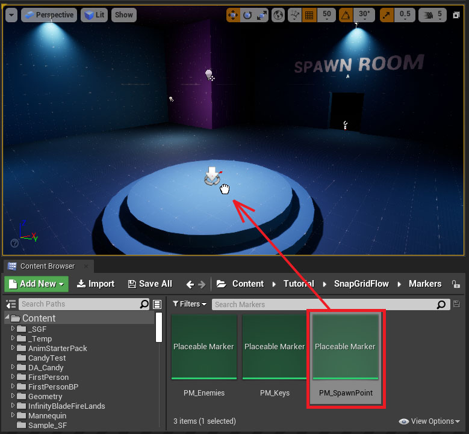

## Register Module

Open up the module database and add this spawn room module like below

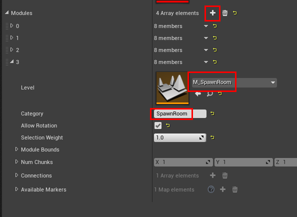

Set the category name to `SpawnRoom`.    We'll use this category name in the flow graph shortly, to force it to
use our spawn room while building the main path

Rebuild the module database cache `Build Module Cache`

Save and close the module database

## Update Flow Graph

Open up the flow graph and assign the module database in the editor settings as before

Select the `Create Main Path` node and inspect the properties

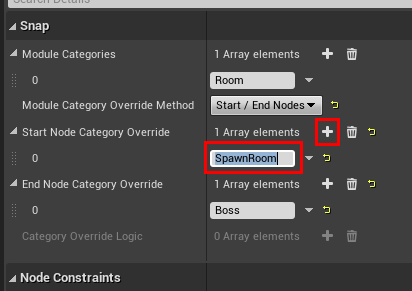

Add an entry to *Start Node Category Override* and set it to `SpawnRoom`.  

This will make the flow editor choose the start room registered in the module database with the specified category. As 
of now, we have only one spawn room, feel free to register more modules with the same name to have 
it randomly pick one spawn room

Hit build in the flow editor and make sure it generates a flow graph correctly

## Spawn PlayerStart under marker

Open the theme file we created previously.

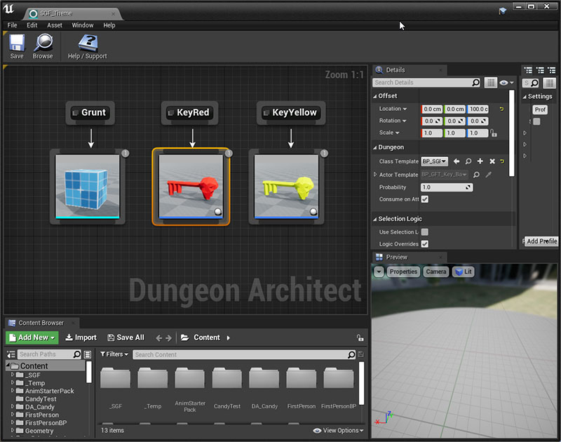

Create a new Marker node `SpawnPoint`

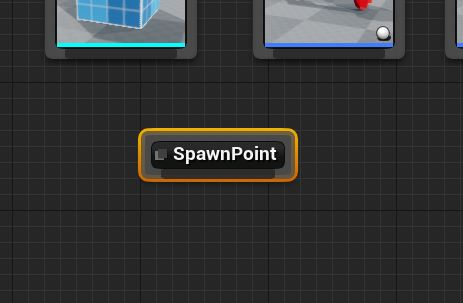

Resize the theme editor a bit and drag-drop the `PlayerStart` actor from the main level window on to the 
theme editor as shown below

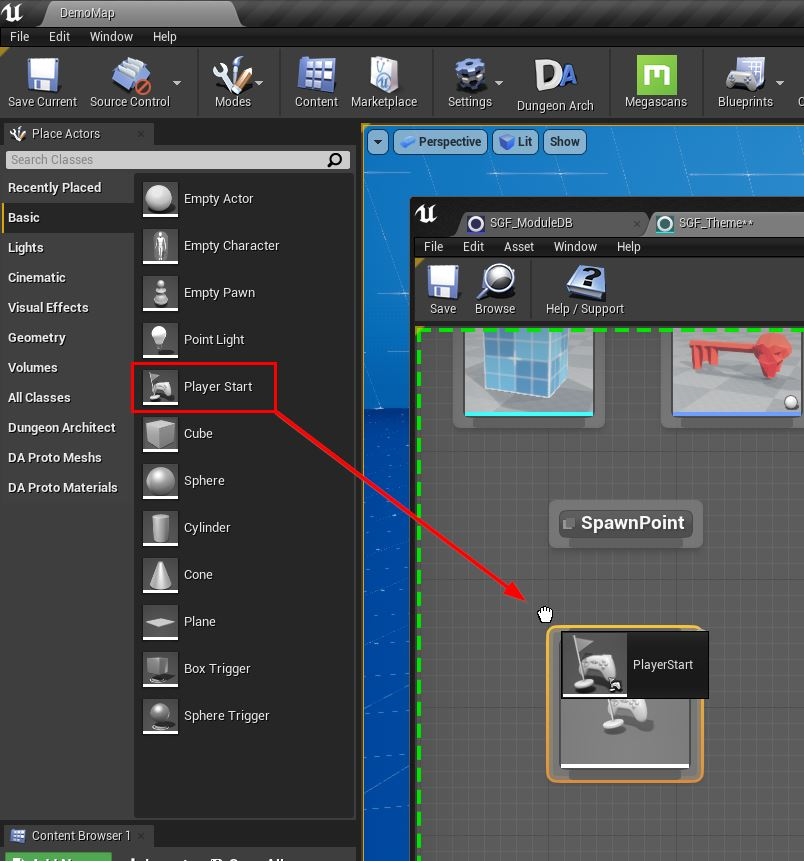

Link it with the `SpawnPoint` marker node

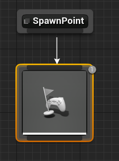

Select the `PlayerStart` actor node and move it up by `100` units 

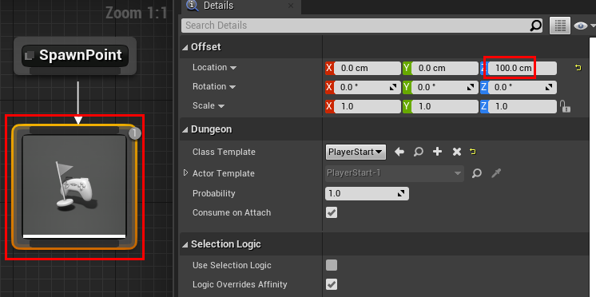

Save and close the theme editor

## Build dungeon

Open the scene where we previously [set up](sgf-build-dungeon.md) our dungeon.  Rebuild the dungeon

You should see the spawn room, and a `PlayerStart` actor spawned at the correct place

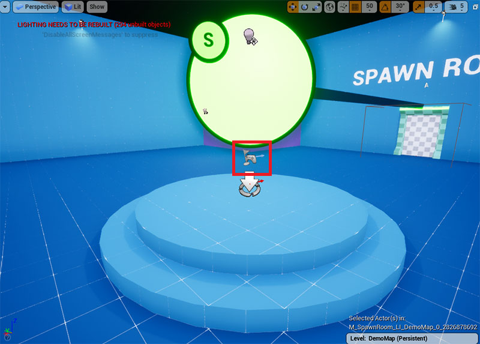

