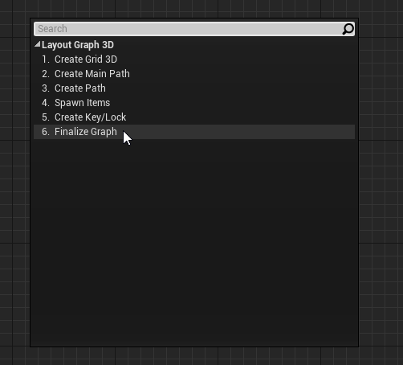
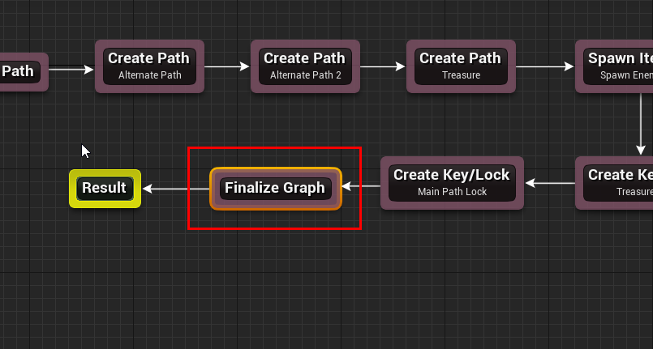
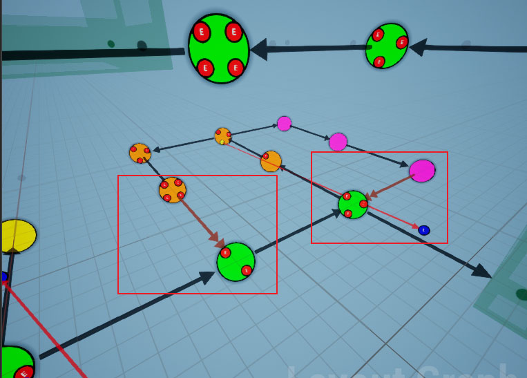
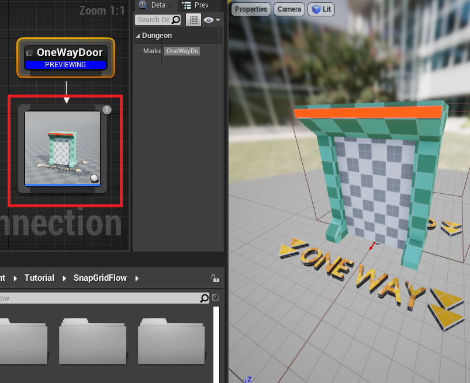
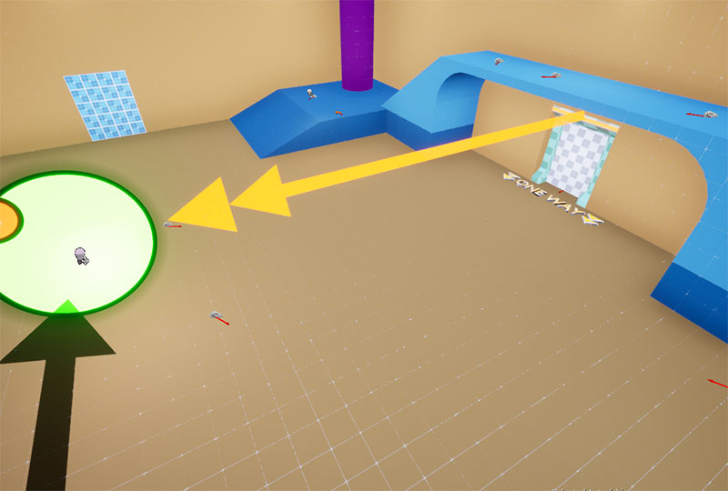

The last node of your flow graph should always be the `Finalize Graph` node.  This node does the following:
* Strategically promote some doors to `one-way` doors.  This is done to keep the player from bypassing locked doors
  by entering from another nearby door. This may also be done to keep the player from entering another 
  path from the opposite direction
* Remove unused links from the layout graph 

:::note
Before a door is committed as one-way, the builder walks the level the way a player would, picking up keys and
opening locked doors along the way.  If a one-way door would leave the player stranded (e.g. a key that
can only be reached through a one-way door with no way back), that door stays normal instead.  You'll still
get one-way doors everywhere they are safe to place
:::

## Properties

| Property | Default | Description |
|----------|---------|-------------|
| One Way Door Promotion Weight | `0` | How aggressively doors are promoted to one-way doors |
| Reachability Contracts | *empty* | Routes this node validates and then preserves while promoting one-way doors |

The playability walk above needs an Entrance and an Exit item to know where the level starts and ends.   On maps
that have neither - a team map built from several spawn paths merging into a hub, for instance - there is no
single route to check, and this is what `Reachability Contracts` is for.   Each contract names a route the
finished map must keep open, for example each team's spawn path must be able to reach the central hub without
running into a locked door.   The build validates every contract and retries the layout when one cannot be met

The `Create Key Lock` nodes add their own pairs to this list automatically, so you only need to declare the
routes that your own layout depends on

## Add Finalize Node

Open the flow graph we designed earlier and add a `Finalize Graph` node

Link it before the `Result` node as shown below

Build the graph and have a look at the layout graph

Some links are converted to one-way doors, and they are represented by a double arrow head in orange color

We have already specified a one-way door asset in the connection editor in the 
[previous](sgf-connections.md#setup-one-way-door-asset) section

This one-way door blueprint will be used in those locations

## Build the dungeon

Open the scene where we previously [set up](sgf-build-dungeon.md) our dungeon.  Rebuild the dungeon

You should see one-way doors spawn where needed

---

We have now created a fully playable level and this wraps up our dungeon flow design.  Feel free to add more path or play around
with your own design

In the next section, we'll look at how to set up gameplay where we will build a random dungeon at runtime, 
move the player to the spawn room and have the player character (first person, third person etc) move around the map,
pick up keys, open locked doors and more
