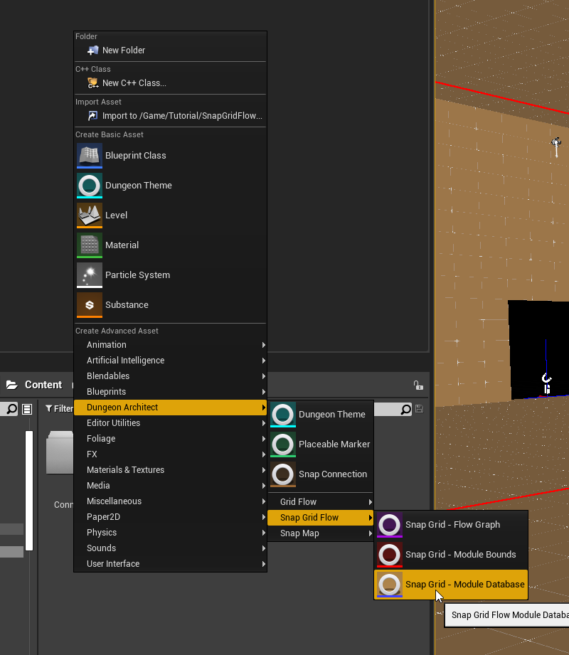
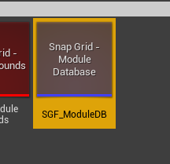
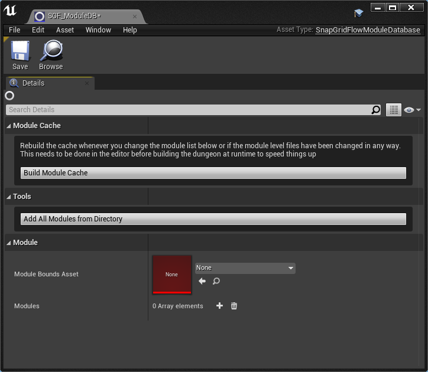
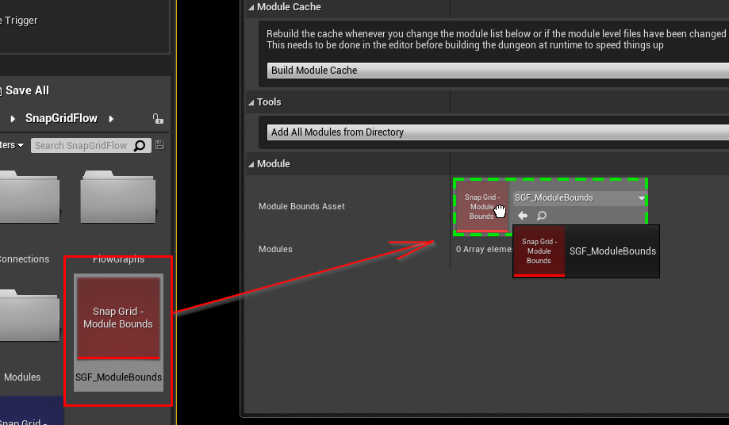
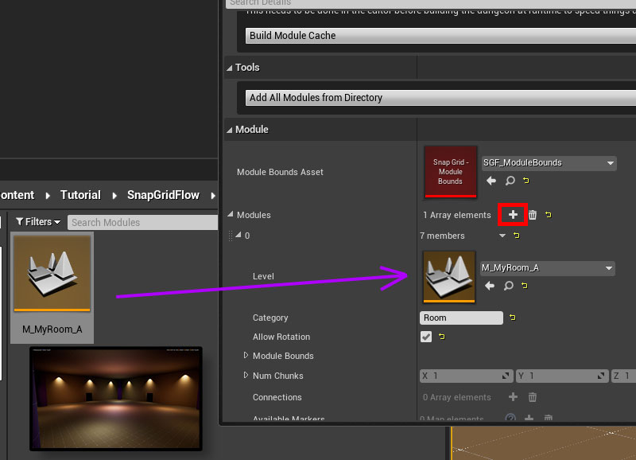
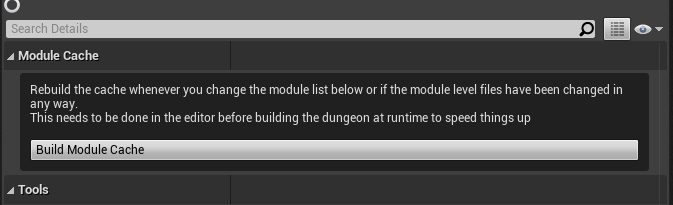

# Module Database

A Module Database is a registry of all the available modules that Dungeon Architect can use to stitch the dungeon

It also contains an acceleration structure with all the necessary information pre-calculated in the editor, so the 
stitching is fast at runtime

You may have different module databases to generate dungeons with different art styles 
(e.g. Sci-Fi spaceships, Medieval castles etc)

## Create a Module Database

We'll create a new module database asset and register the module that we created in the previous sections

Right click on the Content Browser and choose `Dungeon Architect > Snap Grid Flow > Snap Grid - Module Database`

Double click the newly created asset to open up the editor

## Assign Bounds Asset

Assign the Module Bounds Asset we've created in the previous section to the Module Database

Every module you assign in this database should be set up with this `Module Bounds` asset

## Assign Module Entries

Click the `+` icon next to `Modules` to add a new entry. 
* Assign the Module level file we created in the previous section
* Leave the Category to `Room`
* Make sure `Allow Rotation` is enabled

## Build Module Cache

Whenever you modify a module or the Module database, you'll need to rebuild the module cache.   This will perform various 
pre-calculation steps in the editor to make the dungeon generation faster in your game

This is an important step, and you need to remember to rebuild the cache whenever necessary.  
If you move / add / remove a connection in a module, come back here and rebuild the cache

Click the `Build Module Cache` button and save the asset

