A room is designed in a separate map file, and it is called a `Module`

All Modules in the Snap Grid Flow builder have a fixed size called the `Chunk Size`. 
Your module size can be in mulitples of this size (e.g. you can create a taller room of size `1x1x2` 
or a bigger room `3x3x2`)  

## Module Bounds

Start by creating a `Snap Grid - Module Bounds` asset.   You will assign a size for your modules 
here and use it while designing the modules

Right click on the Content Browser and create the `Snap Grid Flow Module Bounds` asset

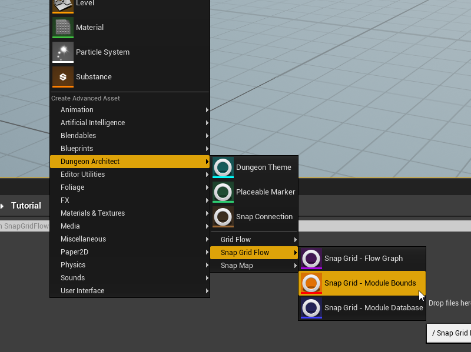

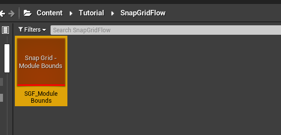

Double click the asset to open the editor
* Set the `Chunk Size` to something like `(5000, 5000, 2000)`.  The `X` and `Y` has to be the same if you want your
  modules to support rotation. In this case, we've provided `5000` for both
* Set the `Door Offset Z` to `500`.  

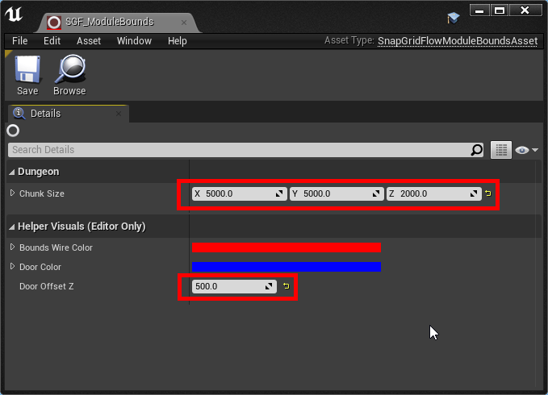

`Door Offset Z` determines how high the door is from the base of the module. It is a good idea to leave some gap, so you have space to create some pits or lower areas 

You'll drop this asset on each of the module levels you design

## Modules

Create a new Level file. We'll design a room module in this file

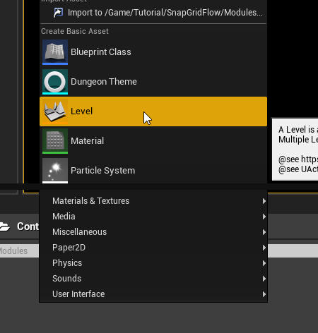

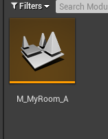

Open this map file and switch to Unlit Mode

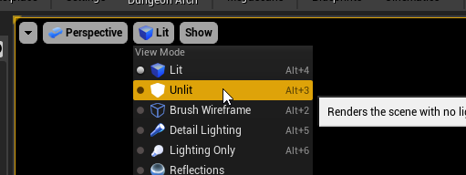

Drag and Drop the Module Bounds Actor on to the scene

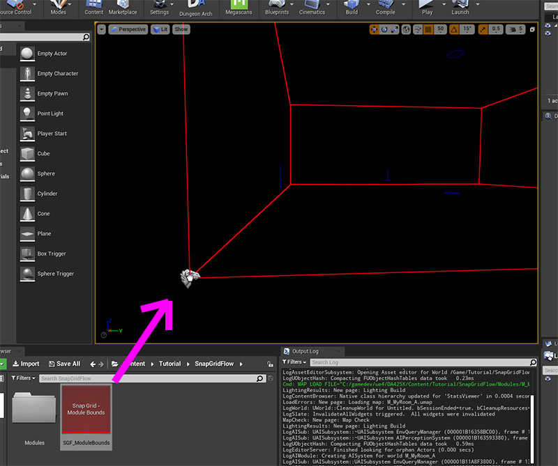

Reset the Transform of this actor

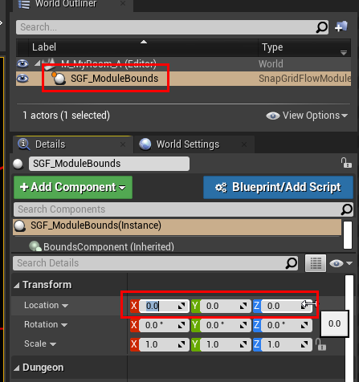

Design your module inside the level bounds. 

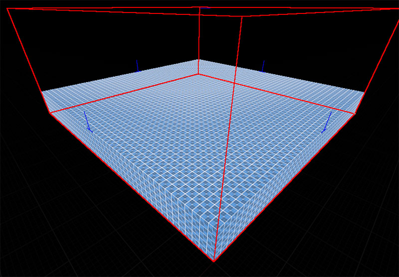

Note how the ground mesh was aligned to a height where it matched the door indicators (blue lines). 
These blue lines were previously configured to be 500 units above the module's base `(DoorOffsetZ)`

Go ahead and design the rest of the room any way you like

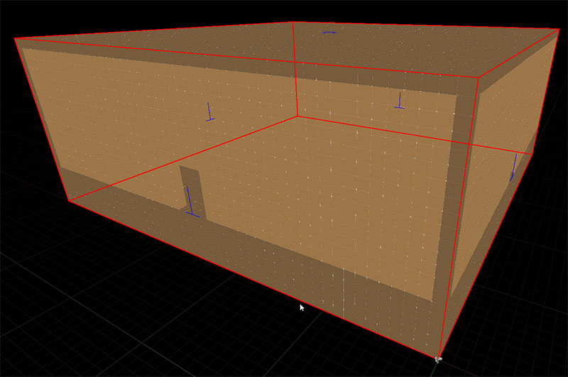

> While designing the rooms, it is always a good idea to enable scale and location snaps in the editor
(e.g. `50` or `100` unit location snap and `0.5` or `1.0` scale snap)
> 
> 
{style="note"}

In this simple example, we want to have doors on all the 4 sides.   A gap of `400 wide / 500 high` was left out at the
door openings.    Our door and wall assets will eventually be of this size to fill up the gap

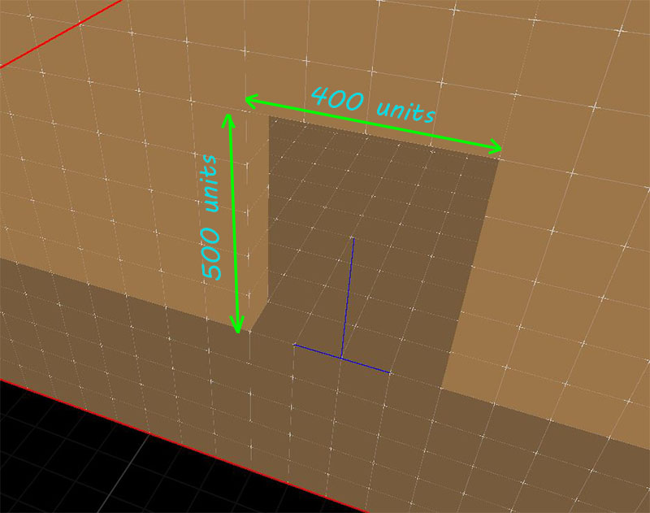

Do this for all the four doors

> You can always turn off the module bounds drawing (the red box) if it is getting in the way.
Do this by selecting the *Module Bounds* actor and disable `Render Bounds`
> 
> 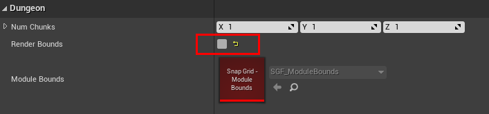
{style="note"}

Optionally, Drop in a few lights and switch to Lit mode

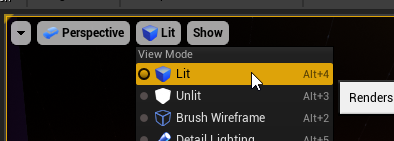

 
> Disable dynamic shadows on most lights as it would affect performance
{style="note"}

In the next section, we'll create a `Connection` and add it near the door openings
