In this section, we'll spawn items like NPCs, power ups etc in our dungeon.

For this, we'll do the following:

* Use the `Spawn Item` node in the flow graph.  This will add items in the layout graph
* Create `Placeable Marker` assets in the content browser and drop a few of them in the snap modules so that 
  the builder can spawn them at those places when necessary 
* Use the Theme engine to spawn the markers

## Spawn Items in Flow Graph

Open up the flow graph and assign the module database in the editor settings like before

Create a new `Spawn Items` node and link it up as shown below:

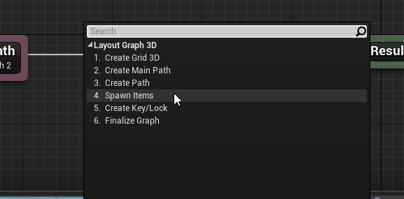

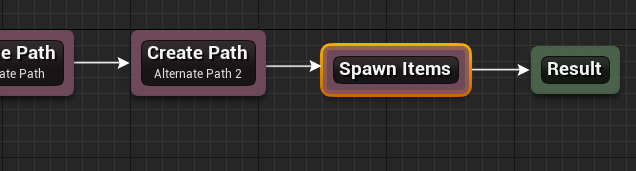

Inspect the properties of the `Spawn Items` node.  Add two paths in the `Paths` array and assign the ids of the
main path (`main`) and the alternate path (`alt`)

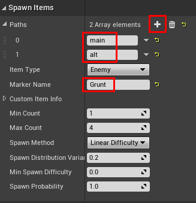

We'd like to eventually spawn something in the modules using the theme file.  We'll provide a marker name 
here, so we can create a corresponding marker node in the theme file and add our NPC blueprint there

Set the `Marker Name` parameter to `Grunt`

Leave the rest of the properties unchanged and hit `Build`

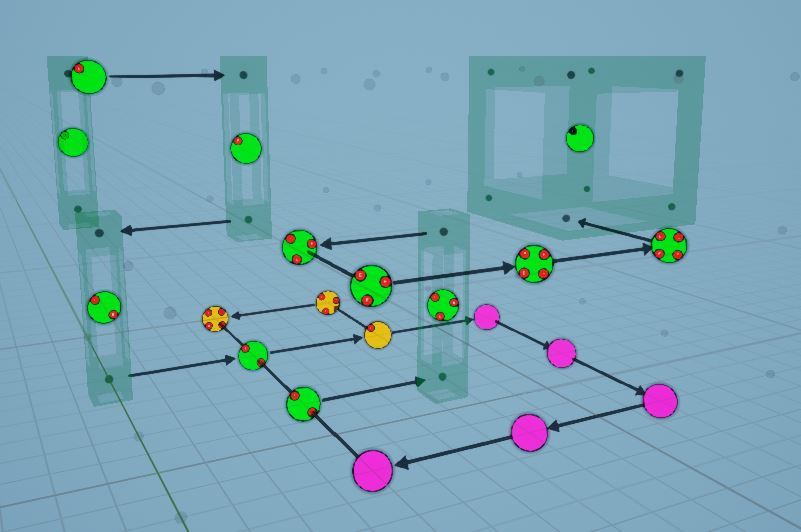

The nodes now in the green path `(main)` and orange path `(alt)` have red enemy items that were created using the 
`Spawn Item` node 

Add a description to this node

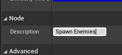

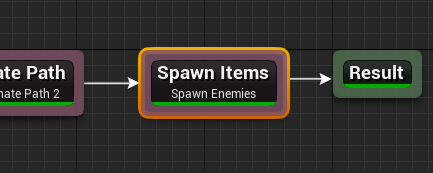

## Placeable Markers

A placeable marker is an asset you create in the content browser.   You can then drag and drop these assets anywhere
on the scene. You can then use the theme file to spawn objects at that location. 

A placeable marker asset can contain more than one marker name. For example, a placeable marker asset named 
`PM_Enemies` may contain a list of marker names like (`Grunt`, `FireTroll`, `IceTroll`, `Goblin`).  In your snap module,
you'd place these markers in appropriate locations (say 10 different locations within the room). 

If the dungeon builder needs to spawn a `Grunt` marker 4 times inside the room, it will first find all the existing and 
compatible marker assets placed in the room. In this case `PM_Enemies` would be compatible since it contains a 
`Grunt` marker.   Since we have 10 of these in the room module, it will randomly pick 4 from them and use the 
theme file to spawn the grunt blueprint

### Create Asset

Right click on the Content Browser and choose `Dungeon Architect > Placeable Marker`

Rename the asset to `PM_Enemies`

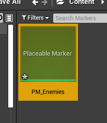

Double click the asset to open up the editor.  Add a `Grunt` marker (since we specified this earlier in 
the `Spawn Items` node).  Add a few more markers for future use like `IceTroll`, `FireTroll`, `Goblin`

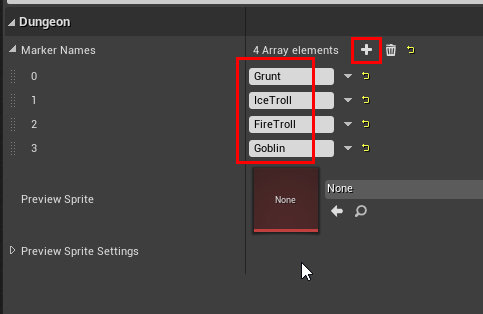

Save the asset and close this editor

### Add to Snap Modules

Open up the previously created room module

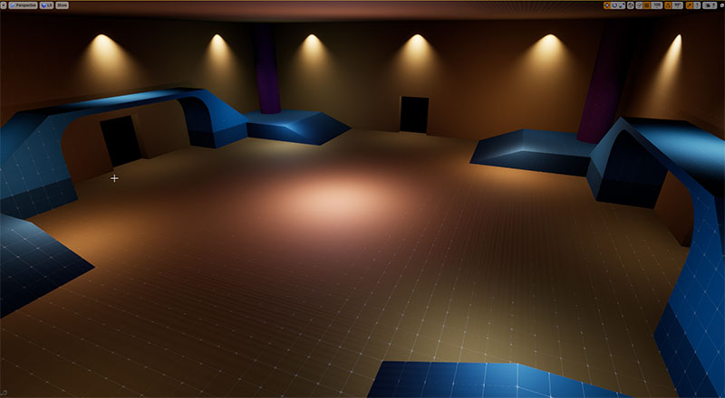

We've added a bit of geometry to the room.  The snap system gives complete freedom to the artist to design the room 
as they see fit.   In that same spirit,  the artist should also have control on where the markers spawn.  This is 
where placeable markers come in

Drag drop the placeable marker asset that you've created before, on to the scene

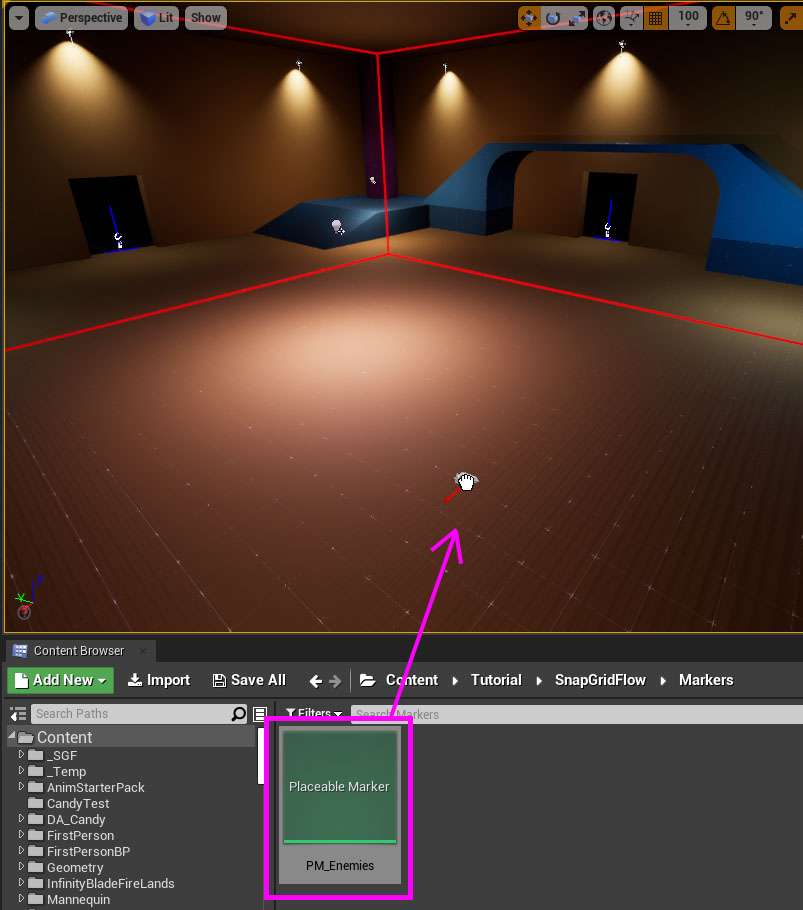

When you drag drop a marker asset in the scene, it will create a placeable marker actor. Select the actor that you 
just dropped

It will show some debug info, like the maker asset name, and the marker names it contains

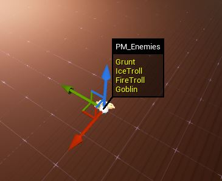

Rotate the actor as needed.  The red arrow shows the orientation of the marker.  When the theme engine
spawns an actor here, it will do so with this rotation

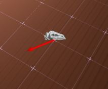

Add a few more markers.  Add at least 4 markers, since we are adding a maximum of 4 enemy items per node in the 
flow graph using `Spawn Item`,   but adding more is always better.  We'll add a few on top of the bridge, on the ramp,
and some more on the ground

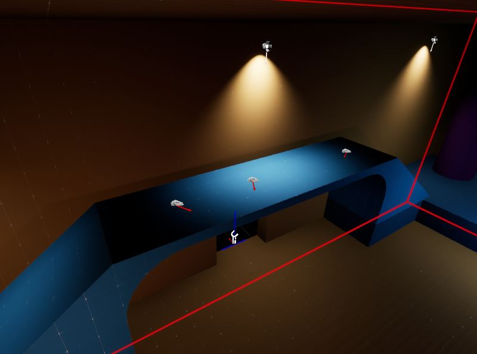

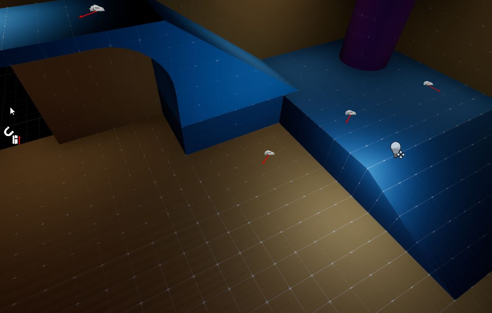

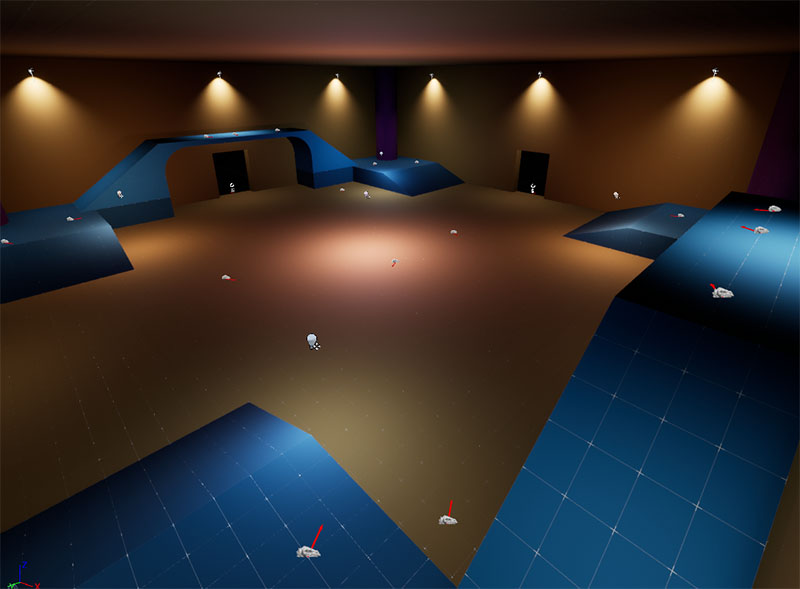

Do this for all the modules you've created so far that would need this marker in it

Open up the Lift module and add a few more placeable markers there

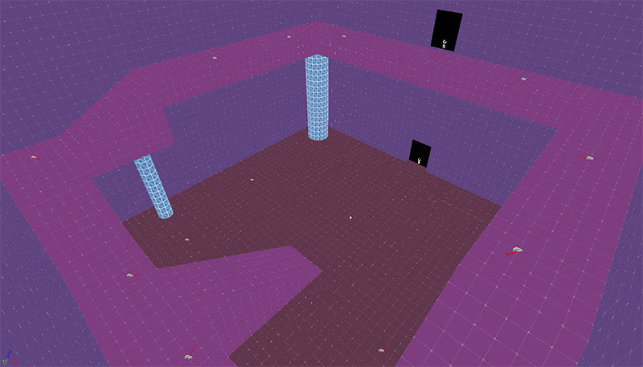

## Rebuild Module Database Cache

If you add / remove a placeable marker from a snap module, you'll need to rebuild the module database cache

Open up the Module database we've created in the previous section and click `Build Module Cache` button.
Save and close the module database editor

:::warning
This is an important step. Remember to rebuild the cache when needed
:::

## Update Theme File

We'll use a theme file to actually spawn our enemy blueprint.  

### Open Theme Editor

Open up the existing theme file we created in the previous section.    

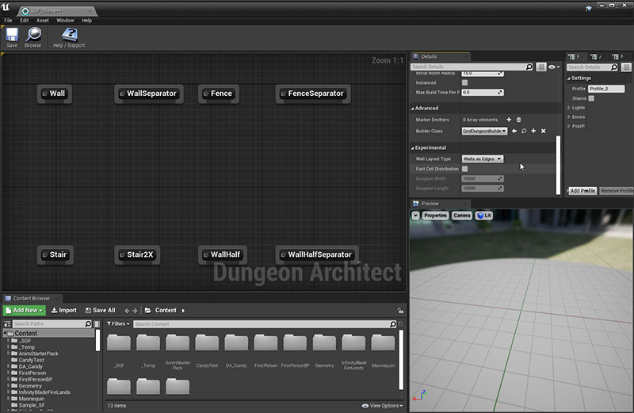

### Change Builder Type

Click somewhere on an empty space in the graph to show the theme properties in the Details tab.

Scroll down to the Advanced section and set the `Builder Class` to `SnapGridFlowBuilder`

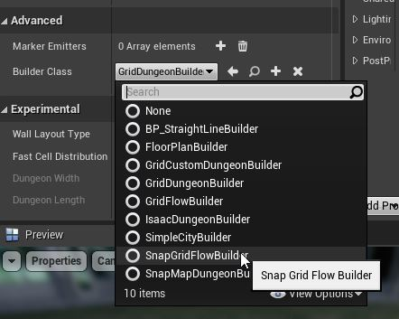

This will update all the marker nodes for that builder.

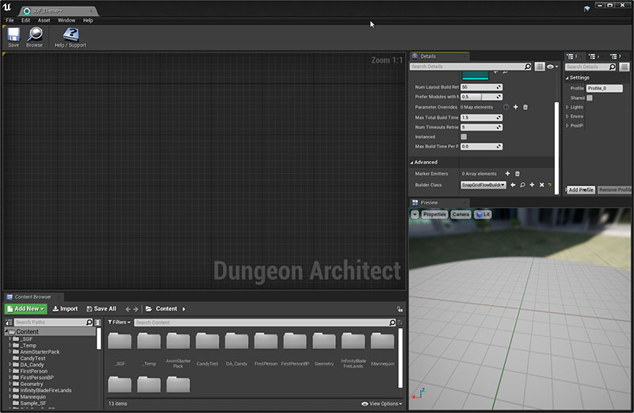

:::note
This will remove unused marker nodes and add the necessary marker nodes used by this builder.  Since the Snap
Grid Flow builder doesn't have any built-in marker nodes, it will not create any new nodes
:::

### Create Marker

In the previous section, we assign the marker name of `Grunt` in the `Spawn Items` node.   In the theme file, we'll 
create a new marker node and name it `Grunt`

Right click on the graph and choose `Add Marker Node`

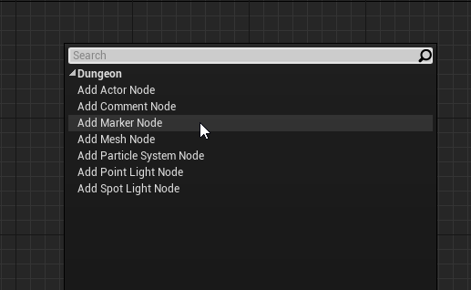

Select the marker node and change the Marker name to `Grunt` in the properties

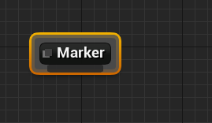

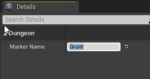

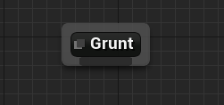

### Add Enemy actor

Add your NPC character blueprint here.    For this tutorial, we'll add a cube and adjust the size and scale

Resize the theme editor a bit and drag drop the proto cube on to the theme editor

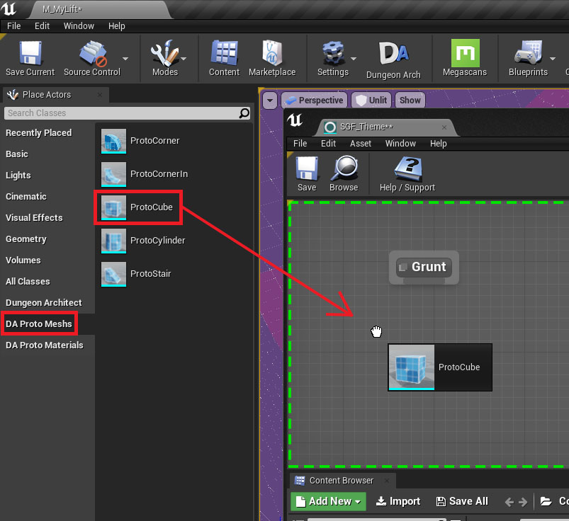

This will create a new mesh node. Add it to the `Grunt` marker node

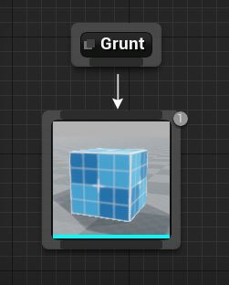

Select the cube mesh node and set the scale to `(1, 1, 2)` 

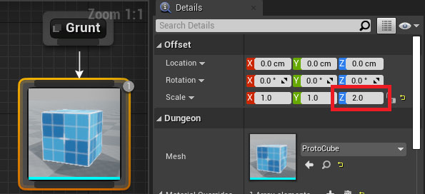

Add a Material Override entry

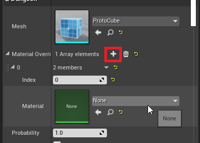

Assign a red material to it

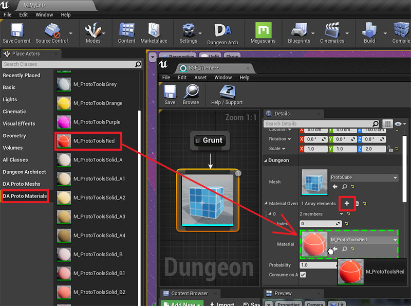

Save and close the Theme Editor

## Build Dungeon

Open the map where we previously configured our dungeon and build it.

You'll see that enemies start to spawn at the locations where you've placed the markers 

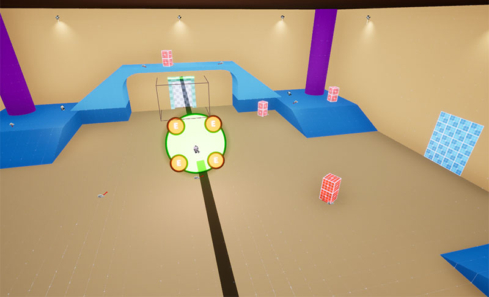

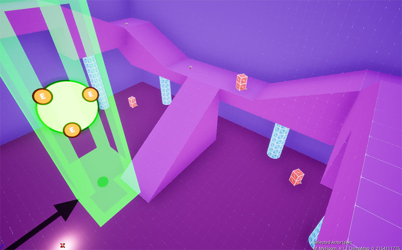

You can use this system to spawn anything (treasure chests, weapon racks, power ups or any gameplay blueprint)
