We'll create a new map and set everything up, so we can play in our dungeon

## Setup Game Map

Open the map where we set up our dungeon in the [previous](sgf-build-dungeon.md) section.

### Enable Level Streaming

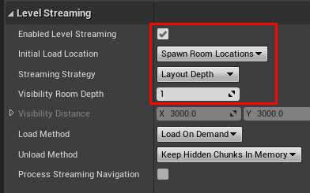

Select the `Dungeon` actor and set `Enable Level Streaming` to true. Update the following parameters:

* Set the *Initial Load Location* to `Spawn Room Location`.   This will make the spawn room be streamed in first.
* Set the *Streaming Strategy* to "Layout Depth".  After the initial modules are loaded in, this parameter determines 
  how the nearby modules will be loaded.   With the `Layout Depth` parameter, it determines the room the player
  is in and streams in all the nearby connected rooms
* Set the *Visibility Room Depth* to `1` or `2`.  This specifies how many connected rooms do you want to stream in. 
  A value of `1` would stream in all the connected rooms the player is in.  A value of `2` and go another step further
  and stream in all the rooms connected to these rooms, and so on

> For side scrollers, set the streaming strategy to `Distance`, this will stream in all the rooms visible on the camera,
regardless of their connection depth to the room the player is in.  Update the distance value depending on how far away
your camera is
{style="note"}

## GameMode Blueprint

We'll add the game logic in a GameMode blueprint where we build a random dungeon, wait for the dungeon to stream
in the spawn room, place the player in the spawn room and start the game

### Create Blueprint

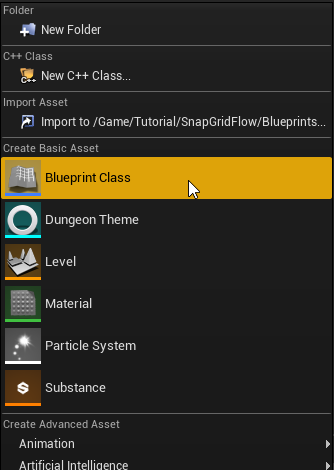

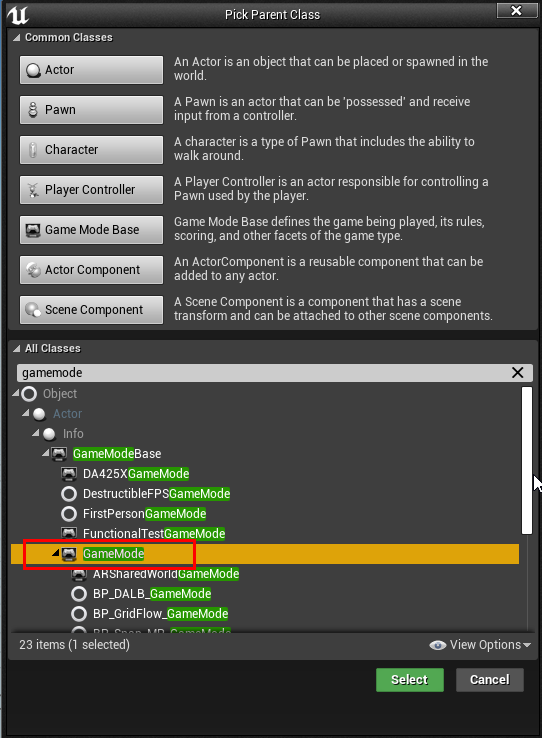

:::warning
Choose `GameMode` and not `GameModeBase`
:::

Open the blueprint 

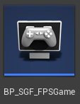

### Setup BeginPlay

Create the following two variables:

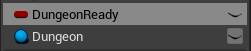

Create a boolean variable named `DungeonReady` as follows:

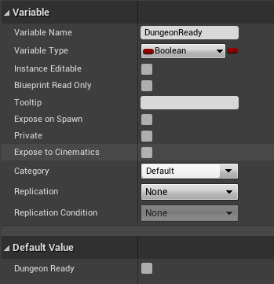

Create a Dungeon Actor variable named `Dungeon` as follows:

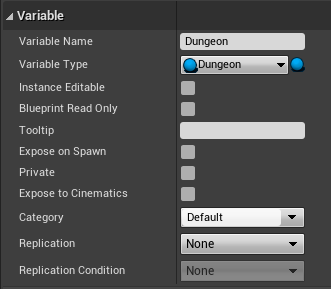

Add this to the `BeginPlay` (right click the below image and click `Open Image in New Tab` for larger view)

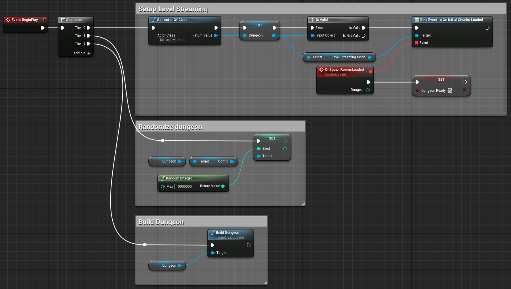

This blueprint does a few things:

* Find a reference to an existing dungeon actor in the scene and save it in the `Dungeon` variable

  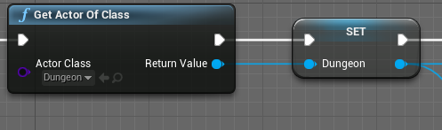

* Hook to an event that fires when the initial chunks are fully streamed in

  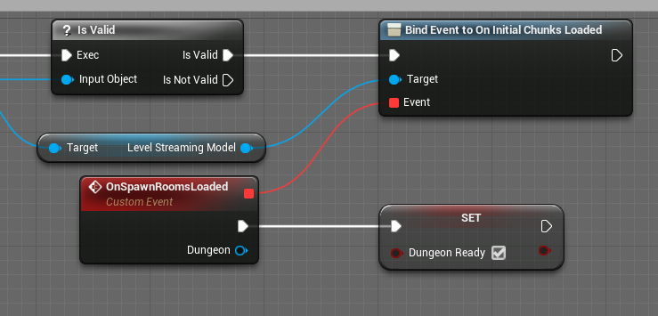

  We've previously configured the dungeon actor to load the spawn room as an initial chunk.   So this will fire after
  the spawn room is fully loaded in and visible.    

  A good side effect of this is, the `PlayerStart` actor that was in the spawn room is also streamed in,
  and now we know where to spawn the player.
  
  After the spawn room is fully loaded, we set the flag `DungeonReady` to true to start the game (more on the shortly)
* Randomize the dungeon before building it.   This gives us a different dungeon every time we play

  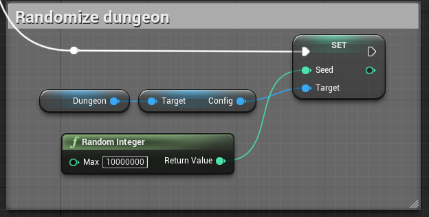

* Finally, build the dungeon

  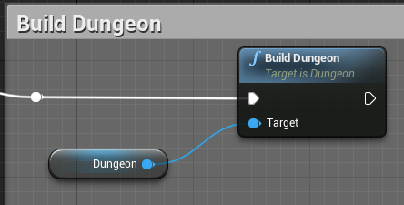

### ReadyToStartMatch

We want to wait till the dungeon is fully built, before starting the game

Unreal Engine provides a function named `ReadyToStartMatch` in the *GameMode* blueprint that lets you wait in 
spectator mode, until we are ready.  As long as we keep returning `false` in this function, it will stay in
spectator mode and start the game only when we return `true`

We have a variable `DungeonReady` that is set to false by default and is set to true only after the spawn room has 
been fully streamed in.   We will override this function and simply return the value of this variable

Override the `ReadyToStartMatch` function

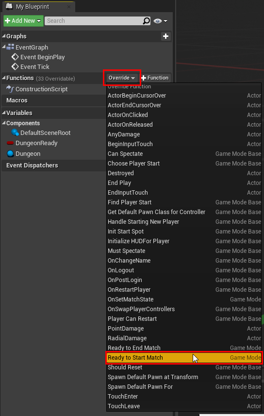

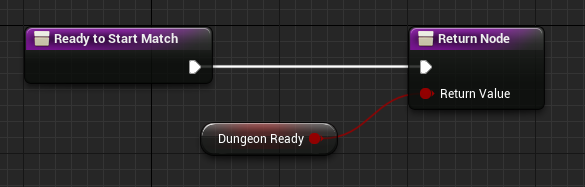

This will make the game wait in spectator mode till the dungeon is built, and the spawn room is fully streamed in

### FindPlayerStart

After the game starts, the engine lets us choose a `PlayerStart` actor to spawn our player character at.   We want 
to choose the `PlayerStart` character that was streamed in along with the spawn room

Start by overriding the `FindPlayerStart` function in the *GameMode* blueprint

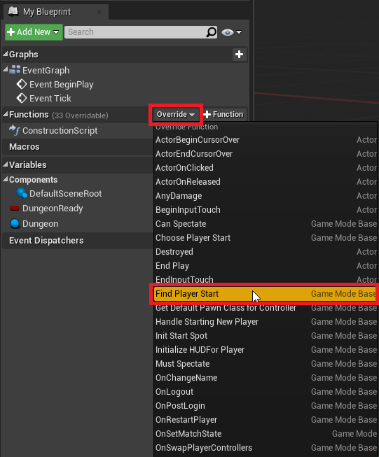

Implement the function as shown below (right click the below image and click `Open Image in New Tab` for larger view)

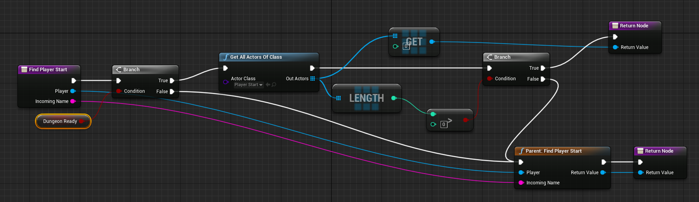

We check if the dungeon is ready (i.e. the spawn room is fully streamed in). If so, we search for a `PlayerStart` actor,
which we know will be there, since we've configured the spawn room to have one.  Otherwise, we return the player 
character that we received as input to the function (this function might be called multiple times, 
even in spectator mode, so we need to do this for the engine to work correctly)

> To create the `"Parent FindPlayerStart"` node, right click on the `FindPlayerStart` function and choose 
`Add call to Parent function`  
{style="note"}

> Make sure there are no other `PlayerStart` actors in the scene.  You'll need to delete the default `PlayerStart` actor
in the main scene file, to make sure that doesn't get picked up
{style="warning"}

## Finalize Game Map

### Delete default PlayerStart

In the map where we set up our dungeon actor, make sure we don't have a `PlayerStart` actor.  If there's one, delete it

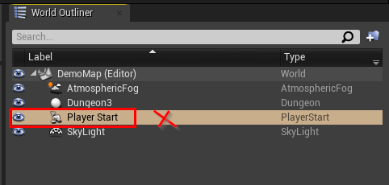

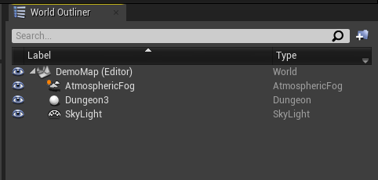

### Set Game Mode

We created a `GameMode` blueprint, and we'd like to use it in this map.  Open up *World Settings*

From the Level Editor's main toolbar, choose `Settings > World Settings`

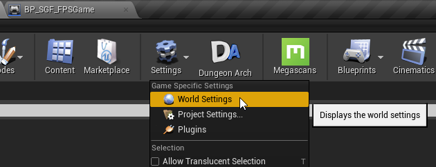

This will open up the World Settings panel.   Set the Game Mode to the blueprint we just created

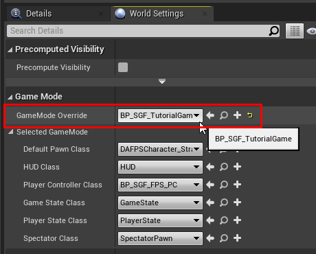

Hit Play.  A random dungeon will be built, and you will be moved to the spawn room

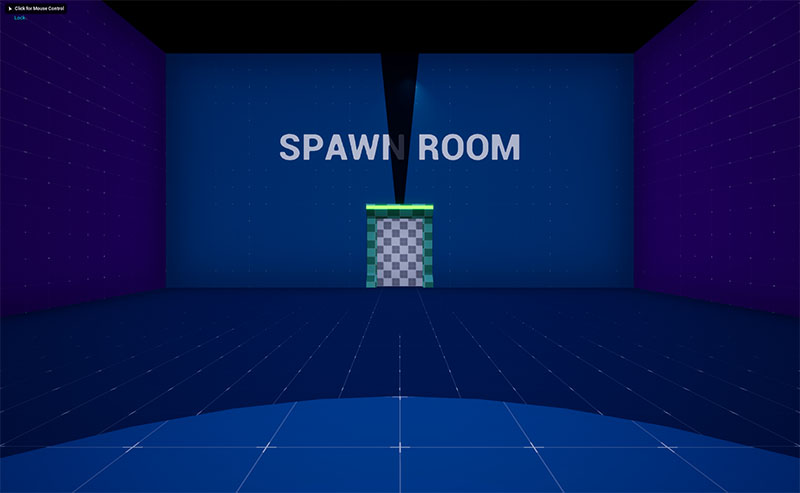

### Add Character class

Let's add a first person character, so we can walk around and open doors.  Add a First Person (or third person) content
pack from the Content Browser's `Add New` button

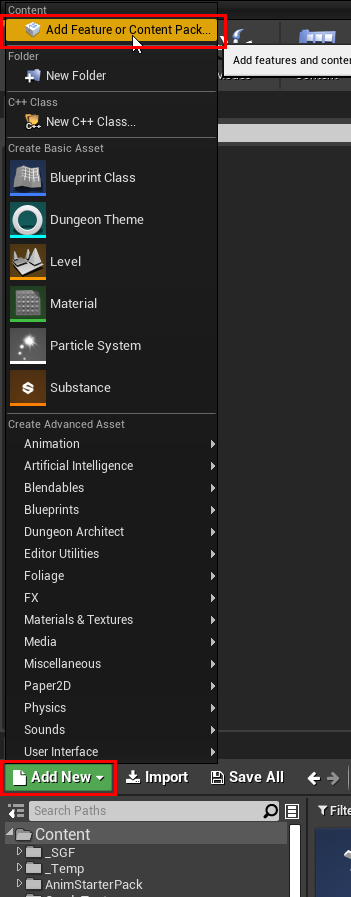

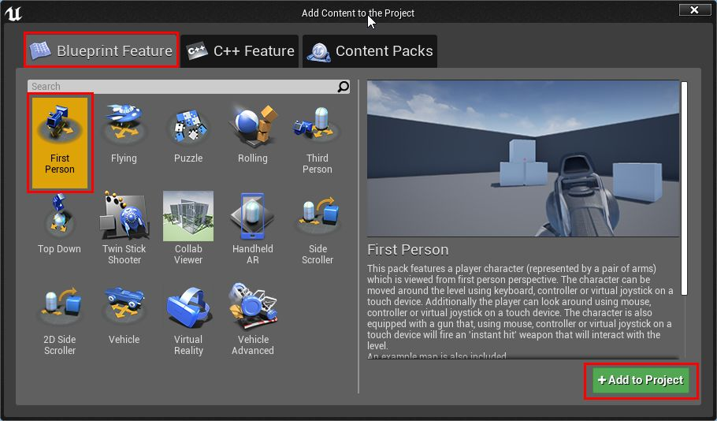

Navigate to the content folder and find the character blueprint

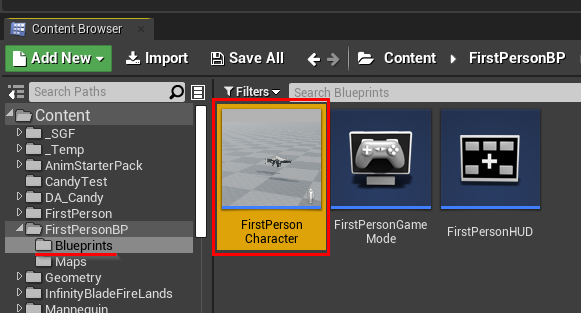

Open the GameMode blueprint we created earlier and assign this character blueprint to it 

Open the game blueprint: 

Click `Class Defaults`

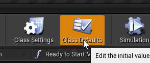

Set the `Default Pawn Class` to the FPS character blueprint

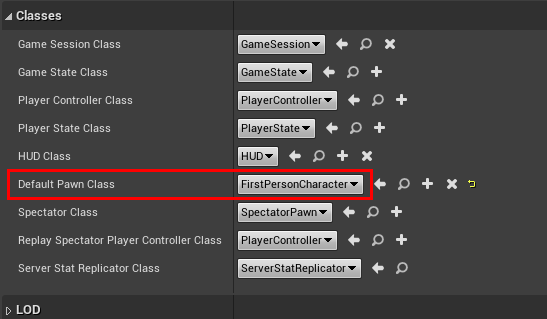

Save and Hit Play

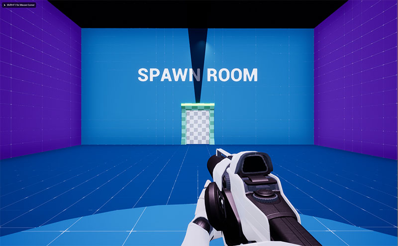

You can now move around and walk through normal doors

## Support Locked Doors

We want to be able to open locked doors after we've picked up the keys.   For this to happen, we need to implement 
a few things: 
* Pickup the keys when we touch them and place it in our inventory
* When we get close to a locked door blueprint, check the keys in our inventory and find out if any one of them 
  can open it
* A UI to show the keys in our inventory
  
Dungeon Architect provides a few helper components to make this easy

### Player Inventory

Open the character blueprint (FirstPersonCharacter or ThirdPersonCharacter)

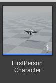

Add the simple inventory component that comes along with the samples

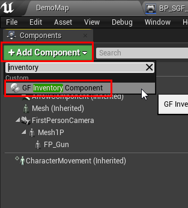

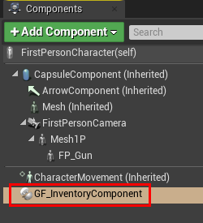

You should now be able to walk around the dungeon, pick up keys and open locked doors

### Player Controller

Add a UI to show the keys in the inventory. We do this with a player controller

Create a new Player Controller and add this to the Begin Play

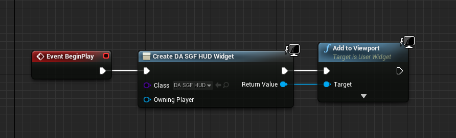

Set the UI reference to `DungeonArchitect Content > Showcase > Legacy > Samples > DA_SnapGridFlow_FPS > Blueprints > UI > DA_SGF_HUD.DA_SGF_HUD`

Hit play and when you pick up keys, they will be added to the inventory and UI shows them on the screen

### Key-Locks Blueprints

When you spawn a Key or a Lock blueprint from the theme engine,  Dungeon Architect will check if the blueprint has
the `Dungeon Flow Item Metadata` component attached to it.  If it has one, it will set a *Flow Item* object to it.   

You can use this object to find the other referenced *Flow Item* objects.    The key *flow item* will reference all 
the valid *lock flow* items, and you can use this to check if the keys can open up a lock

Navigate to the following folder and check how the sample keys and locks are implemented:
`DungeonArchitect Content > Showcase > Legacy > Samples > DA_SnapGridFlow_SideScroller > Snap > Connection > Blueprints > BP_SGF_Key_Base`

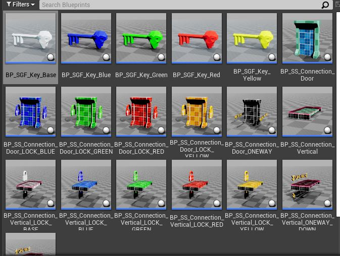
