# Setup Key-Locks

In this section, we'll add a few key-locks to our dungeon using the flow framework

Open up the flow graph and assign the module database like before

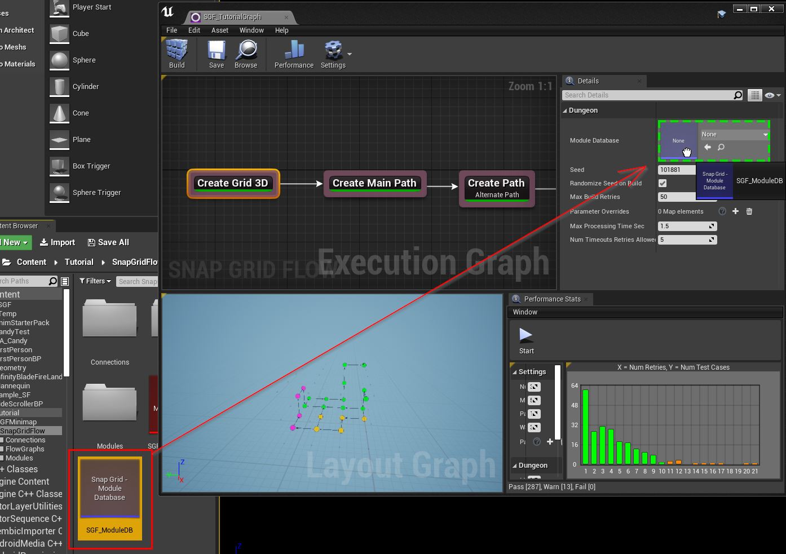

## Create Treasure Room

We'll create a treasure room that is attached to the main path.  We do this by creating a new path (of length 1)
that emits out of the `main` path

Add a new `Create Path` node and link it to the end as shown:

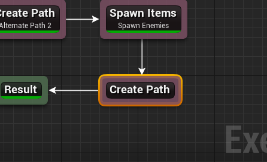

Select the node and inspect the properties

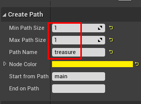

* Set the Min/Max size to `1` since we want a single room to hold the key
* Set the path name to `treasure`.  We'll use this id later to place a key here
* `Start from Path` is set to `main` so this room is connected to the main path
* We want the treasure room to be isolated and don't want it to converge back to another path.
  Leave the `End on Path` parameter blank
* Change the `Node Color` to anything you like

Hit `Build` and you'll see a new treasure room created

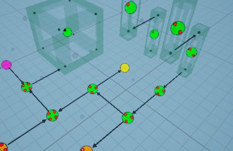

## Treasure Room Key/Lock

We want to lock the `treasure` room and have the key somewhere in the `main` path

Add a new `Create Key/Lock` node and link it to the end like shown below:

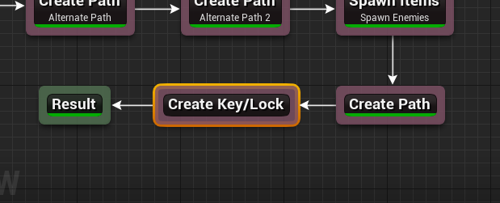

Select the `Create Key/Lock` node and inspect the properties

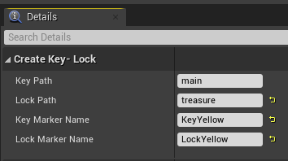

* `Key Path` - Since we want the key to be in the main path, set this to `main`
* `Lock Path` - Since we want to lock the treasure path, set this to `treasure`
* `Key Marker Name` - We'll use the **Theme Editor** to spawn the key blueprint.  Set the maker name to anything you like, however 
  you'll need to create a corresponding marker node with the same name in the theme file to spawn the key blueprint.
  For this tutorial, set this to `KeyYellow`
* `Lock Marker Name` - We'll use the **Connection editor** to spawn the locked door blueprint. Set the marker name to anything you like,
  however you'll need to create a corresponding marker node in the connection editor to spawn the locked blueprint.
  For this  tutorial, set this to `LockYellow`

Hit `Build` and inspect the layout graph

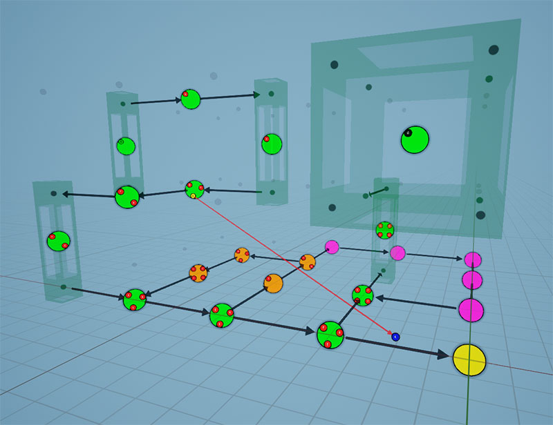

A blue lock item was created on the link that connected to the yellow treasure node. The key was placed somewhere in 
the main path (green).   The red arrow shows the key-lock relationship  

Update the description of this node

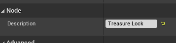

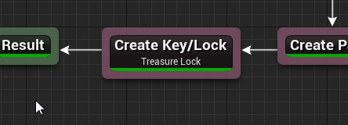

## Main Path Key-Lock

We'll create another key lock for the main path.  The key would be in the `alt` path (orange) and the lock would 
be somewhere in the `main` path.

Add a new `Create Key/Lock` node and link it to the end as shown below:

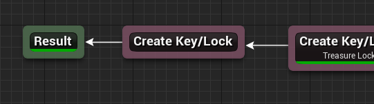

Update the parameters:

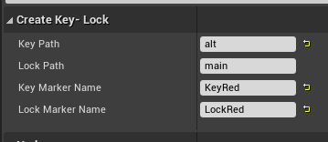

| Parameter        | Value   |
|------------------|---------|
| Key Path         | alt     |
| Lock Path        | main    |
| Key Marker Name  | KeyRed  |
| Lock Marker Name | LockRed |

Hit `Build` and inspect the layout graph

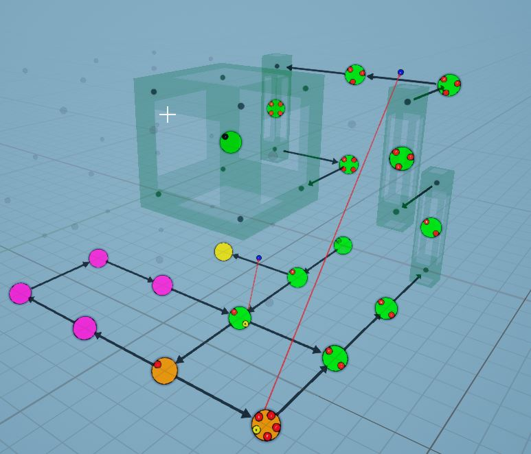

Update the description of this node to something appropriate

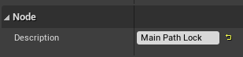

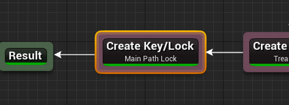

## Spawn Keys

### Setup Theme File

Open up the theme file we created earlier

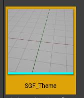

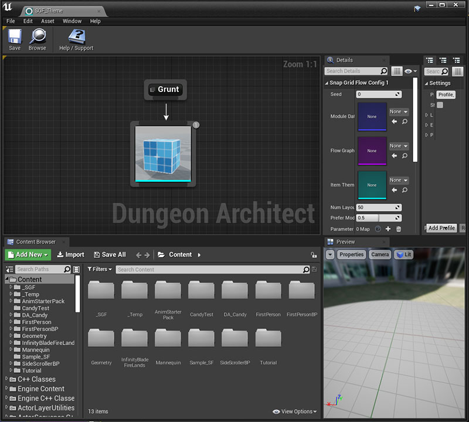

Add these key marker nodes that we've specified in the `Create Key/Lock` node
* `KeyRed`
* `KeyYellow`

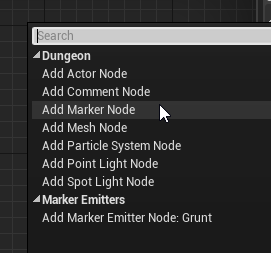

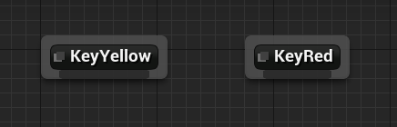

> The maker names are case-sensitive. So make sure you capitalize them correctly
{style="note"}

In the theme editor's content browser, navigate to 
`DungeonArchitect Content > Showcase > Legacy > Samples > DA_SnapGridFlow_SideScroller > Snap > Connection > Blueprints`

Drop in the following key blueprints and link them up

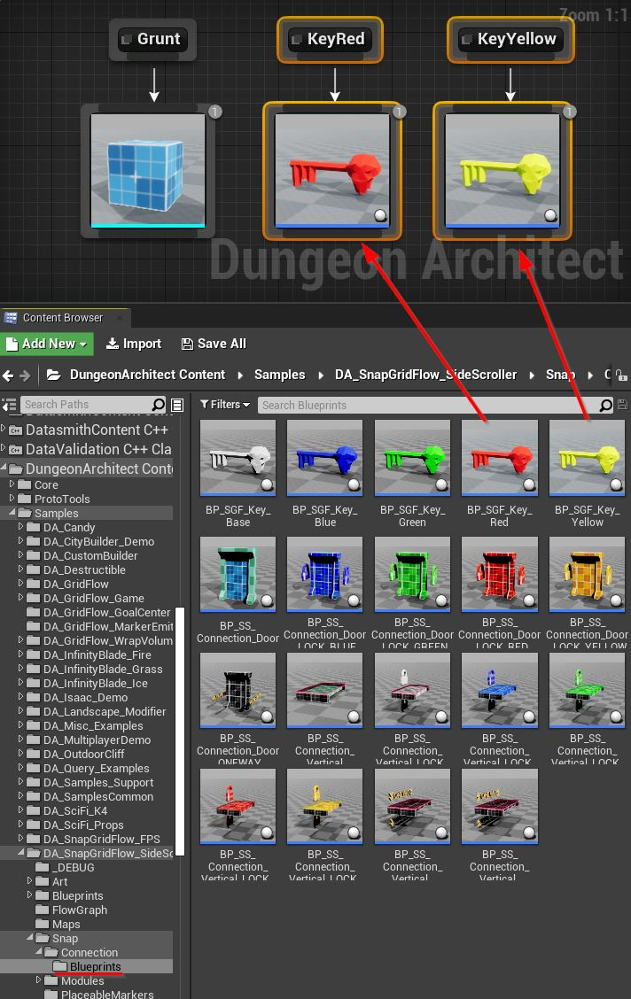

* KeyYellow: `BP_SGF_Key_Yellow`
* KeyRed: `BP_SGF_Key_Red`

With this mapping, we've defined **what** key blueprint to spawn.    Next, we'll create a placeable marker asset
to define **where** to spawn these inside the modules

### Create a Placeable Marker

Create a new placeable marker asset in the content browser and name it `PM_Keys`

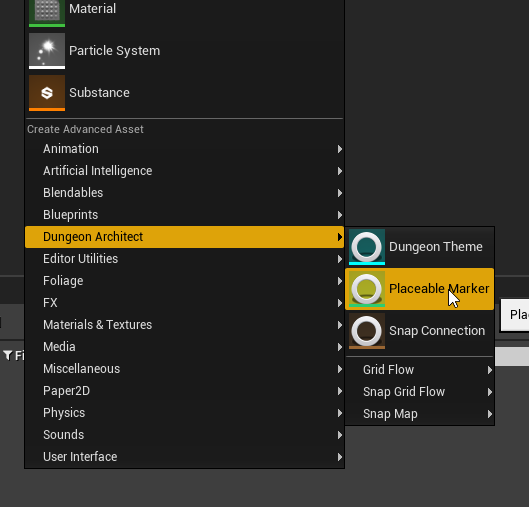

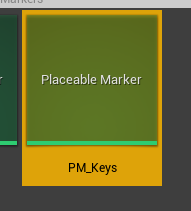

Double click the asset to open up the editor

Add two marker entries as follows

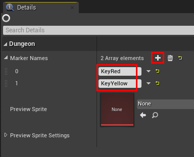

Assign a key preview sprite, so our actors on the scene show a key

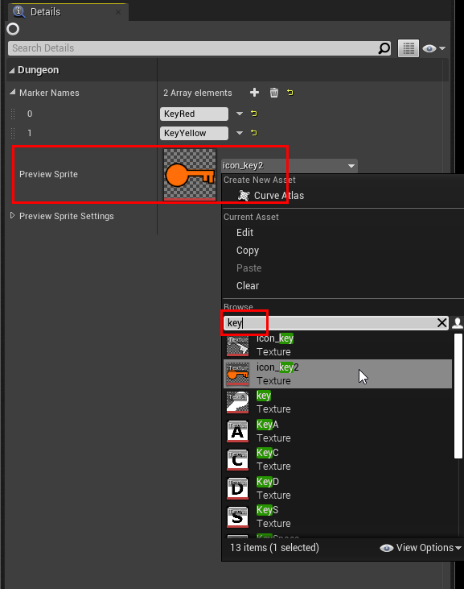

### Place Key Markers

Open up all your room modules and drop in the `PM_Key` placeable marker asset, similar to what we've done with the
enemy placeable marker in the previous section

Drop in at least 2 of these in a room, in case if both the `Red` and the `Yellow` keys spawn in the same room

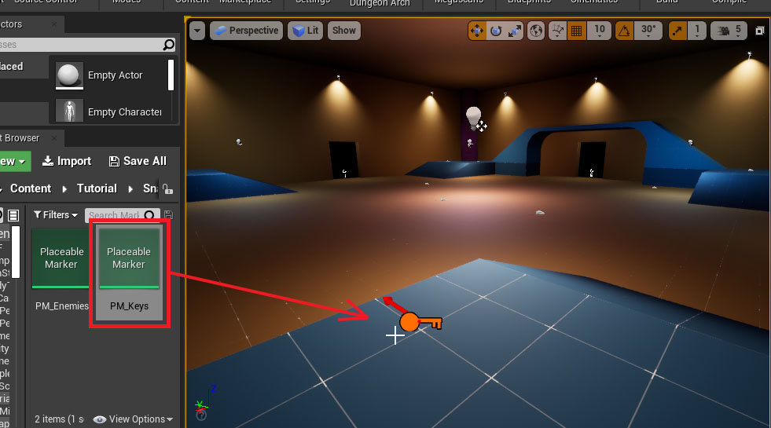

Either move this placeable marker actor up by 100 units (so the key doesn't spawn buried half into the ground), 
or move the key up in the theme editor by selecting the key nodes and moving it up at Z by 100

Add this to the lift module as well

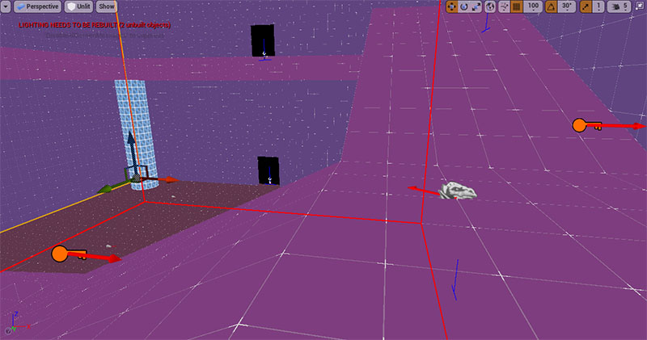

### Rebuild module database

Since we've modified the module's markers, we need to rebuild the module database cache

Open up the module database and click `Build Module Cache`

The system now knows where to spawn the keys in the snap module and what blueprints to spawn at those locations

## Spawn Locks

Locks are door blueprints with locking support (optionally with different visuals based on your art asset)

We'll map these lock blueprints in the connection editor

> Keys are mapped in the **Theme** editor. Locks are mapped in the **Connection** editor, since they deal with doors
{style="note"}

### Open Connection Editor 

Open up the `Connection` asset we've created in the [earlier](sgf-connections.md) section

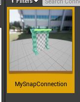

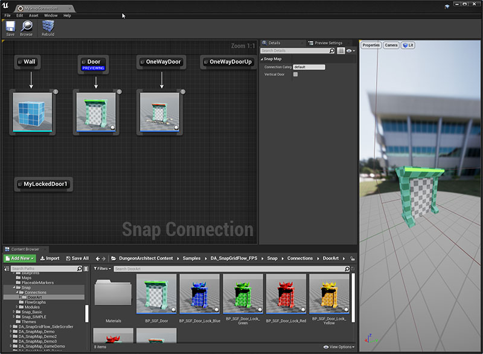

### Create Lock Markers

Right click on the graph and create two marker nodes

* `LockRed`
* `LockYellow`

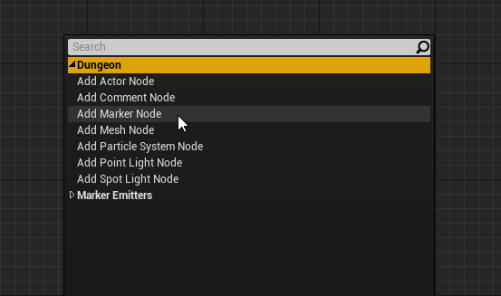

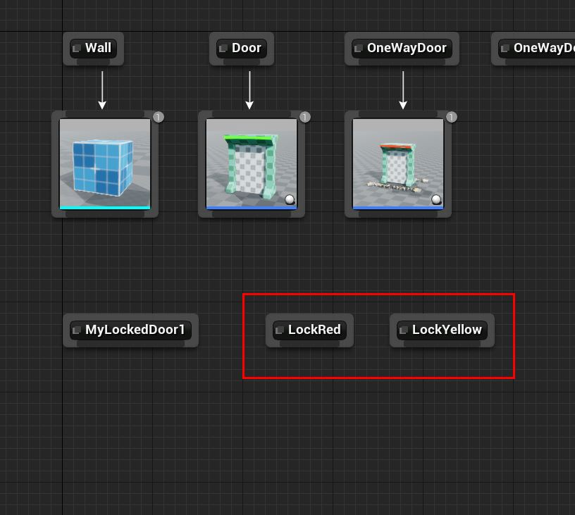

> We used the names `LockRed` and `LockYellow` since this is what we assigned in the `Create Key/Lock` node 
in the flow graph   
{style="note"}

### Assign Lock Blueprints

 
In the connection editor's content browser, navigate to
`DungeonArchitect Content > Showcase > Legacy > Samples > DA_SnapGridFlow_FPS > Snap > Connections > DoorArt` and drop in the following
lock blueprints and link them up

* KeyRed: `BP_SGF_Door_Lock_Red`
* KeyYellow:  `BP_SGF_Door_Lock_Yellow`

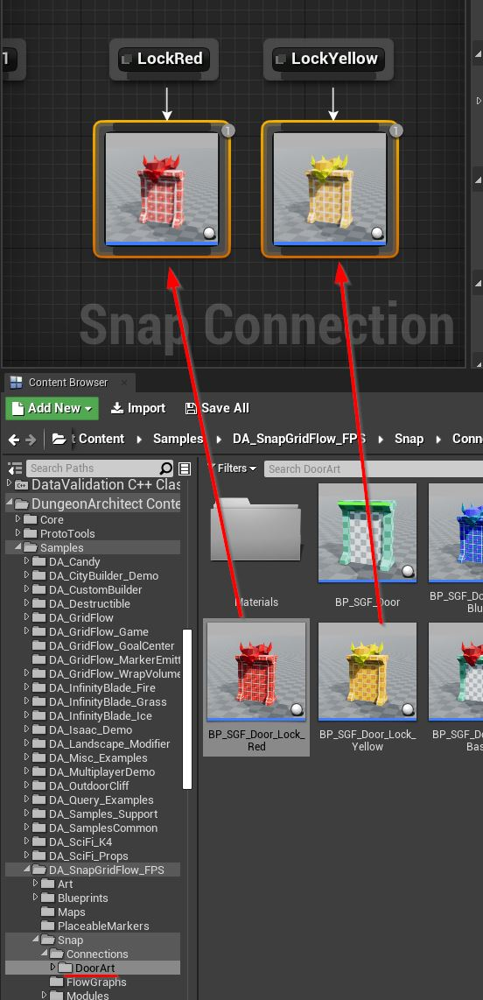

### Fix Transform

Select the `LockRed` marker node (make sure the `PREVIEWING` blue text is shown).   This allows you to preview the 
objects attached under this marker

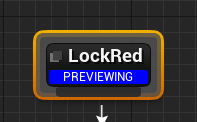

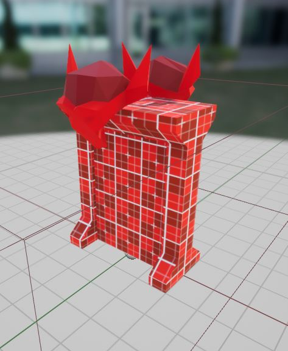

The red arrow is not pointing correctly (it is not visible as it is inside the door)

Select the blueprint node attached under it and set the rotation to `(0, 0, -90)`

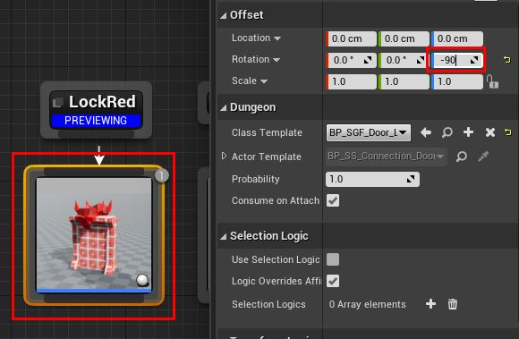

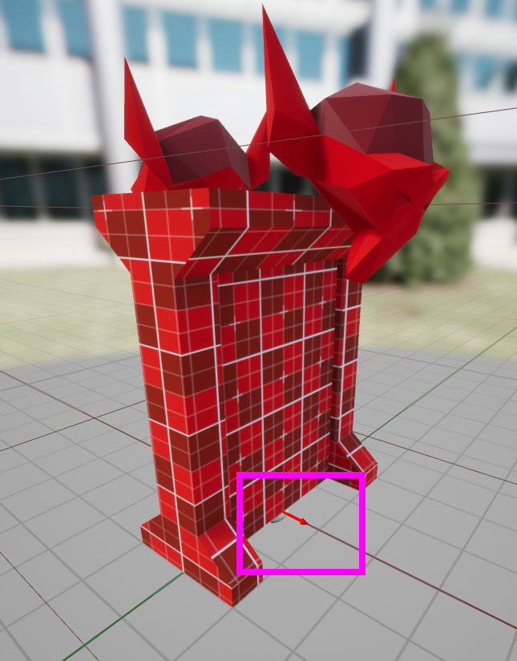

---

Do the same for `LockYellow`

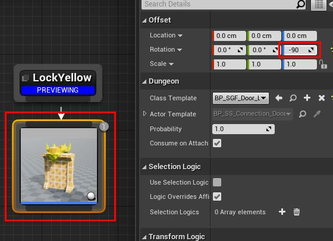

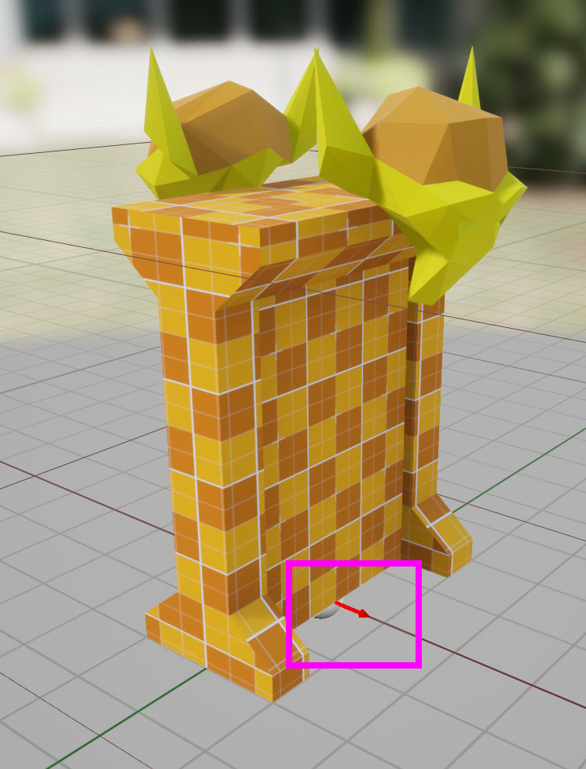

### Build dungeon

Open the scene where we previously [set up](sgf-build-dungeon.md) our dungeon.  Rebuild the dungeon

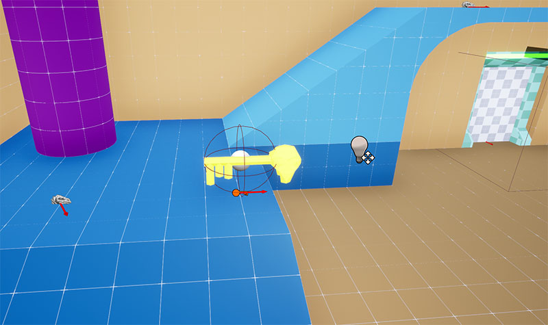

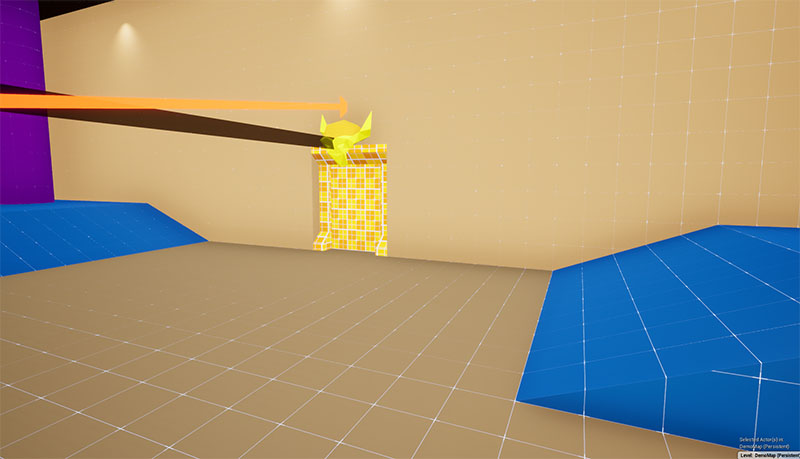

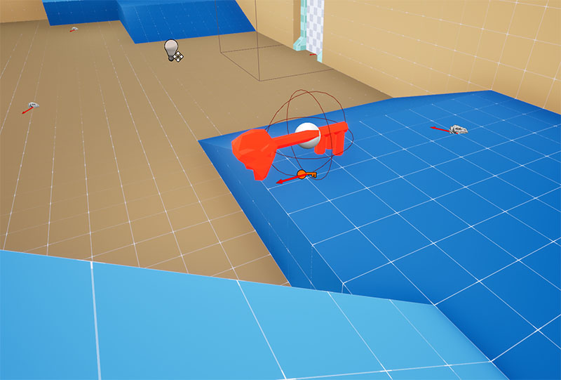

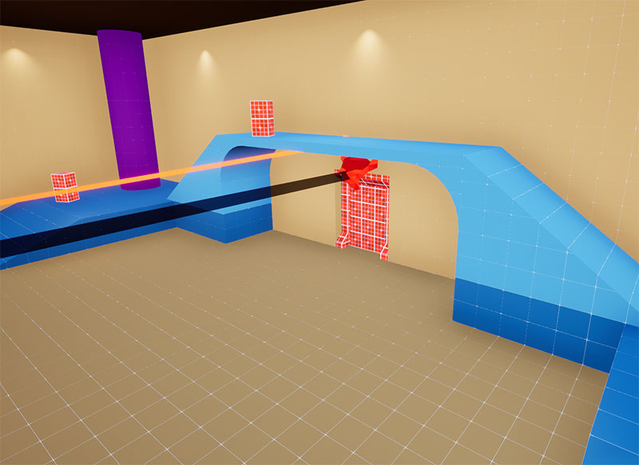

