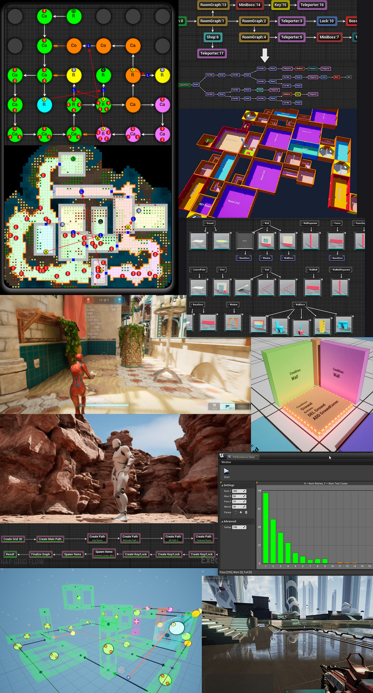

Dungeon Architect is a powerful procedural generation tool designed to assist game developers in creating vast, 
intricate dungeons and environments. 

Within these docs, we'll explore the suite of procedural tools available to
design and construct your dynamic levels, offering both flexibility and control in your creative process.

